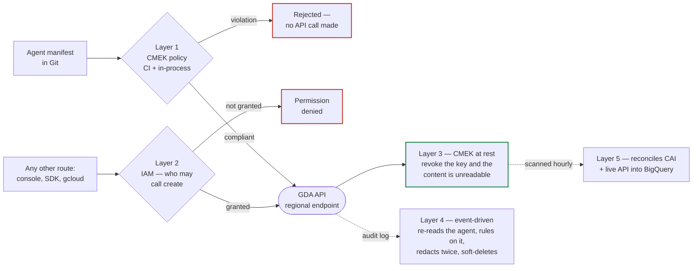
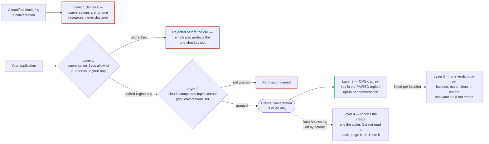

# GDA CMEK Enforcement Framework

> **This is an MVP, not an officially supported Google product.** It is a
> reference implementation, built and validated by hand against two disposable
> projects. There is no SLA, no support commitment and no warranty. Review it,
> adapt it, and validate it in your own environment before relying on it for
> anything that matters.

A working, tested MVP that brings Gemini Data Analytics (Conversational
Analytics) under organization-wide **CMEK governance**.

GDA supports CMEK today, and the key holds as a real cryptographic boundary:
revoke it and the agent content becomes unreadable. The piece still to come from
the platform is *org-policy* enforcement — `geminidataanalytics.googleapis.com`
is not yet accepted by `constraints/gcp.restrictNonCmekServices`, so a key is
supplied per resource rather than mandated centrally. This framework supplies
that governance, in five layers.

## The five layers

| Layer | What it does |
| :--- | :--- |
| 1 — CI/CD policy-as-code | Rejects a non-compliant agent manifest in the pipeline, before it reaches the API |
| 2 — IAM least privilege | Limits who can create an agent at all, so there are fewer ways to bypass the pipeline |
| 3 — CMEK at rest | Encrypts agent content under your key, so revoking the key makes it unreadable |
| 4 — Real-time remediation | Catches an agent created outside the pipeline, redacts its content and soft-deletes it; for conversations, reports the create and attributes the caller |
| 5 — Continuous compliance | An hourly, audit-ready report of every agent's CMEK posture; anything it could not check is marked unverified, never passed. For conversations it can flag a violation but cannot certify a location clean |

Layers 1 and 2 are preventive, 4 and 5 are detective, and 3 is the cryptographic
boundary the other four exist to keep enforced. Each part below opens with a
diagram of its own path — [agents](#how-it-works),
[conversations](#how-it-works-1) — because the two differ at almost every layer.

**They are independent controls, not a pipeline — adopt any subset.** Nothing
here requires all five. What each one gives you on its own, and what it leaves
uncovered:

| Adopt | You get | Still uncovered |
| :--- | :--- | :--- |
| 1 alone | No non-compliant manifest reaches the API from your pipeline | Anything created outside the pipeline |
| 2 alone | Fewer principals able to create a resource at all | What those principals then create |
| 1 + 2 | Prevention on both the pipeline and the ad-hoc path | Nothing detects a gap in either |
| 3 alone | Content unreadable once the key is revoked | Nothing ensures a key is set |
| 4 alone | A non-compliant agent is caught and removed in seconds | Creates the event stream never delivers |
| 5 alone | An hourly audit position over the whole estate | Up to an hour of exposure |
| 4 + 5 | Seconds-to-minutes detection with an hourly backstop | Prevention |

The only build-time coupling is `common/gda_common.py`, which Layers 4 and 5
each embed so their verdicts agree, and `layer3/deploy.sh` calling the Layer 1
gate, which is what makes it a policy-gated deploy. Layer 5 reads Cloud Asset
Inventory and the live API — never the enforcer's output — so it stands alone
and is what catches the creates Layer 4's event stream misses.

**This is not equivalent to native CMEK org-policy enforcement.** Native
enforcement stops a non-compliant resource from ever existing. This framework
detects one seconds after it exists, scrubs its content, and soft-deletes it —
leaving a redacted tombstone for 30 days, because the API has no purge.
Disclose the exposure window and the residual retention to risk and
compliance. See
[§8 Control Equivalence Matrix](docs/design.md#8-control-equivalence-matrix).

**Scope: two resource types, both covered.** `DataAgent` and `Conversation`
each carry customer content and each take a CMEK key, and all five layers cover
both. Stateless chat is the third thing the API offers and creates no resource
at all, so there is nothing for CMEK to hold — Layer 2 governs who may call it
and that is the whole of it.

The mechanics differ between the two — different key locations, a different
audit service, a different remediation story — so `Conversation` get its own
[deploy step](#part-2--conversations) and
[validation suite](#reproduce-the-conversation-tests) rather than
being folded into the `DataAgent` flow.

## Getting started

Stands up a **working demo** of both resource types. The two parts below are
self-contained and run in order: **[Part 1 — GDA agents](#part-1--gda-agents)**
then **[Part 2 — Conversations](#part-2--conversations)**. Each covers its own
deploy, how it works, how to reproduce the tests, and the results. Everything in
this section serves both.

Which KMS location each resource type needs is tabulated in
[Where the CMEK key goes](#where-the-cmek-key-goes).

Deploying needs `gcloud`, `bq` and Python. OPA and Regal are needed only to run
Layer 1's own tests; the block below installs everything in one go.

**Install** — versions are pinned deliberately: the policy is Rego v1 (OPA ≥1.0)
and `.regal/` carries a custom rule written against Regal's 0.42 rule API.

```bash
# Layer 1 needs no install. Its CI half ships as a GitHub Actions workflow —
# one implementation of the control, not the control itself. To watch it fire,
# the code has to live in a repo you own: fork this one and clone your fork, or
# repoint this clone afterwards:
#   git remote set-url origin https://github.com/<you>/<your-repo>.git
#   git push -u origin main
# On any other CI you port the same two steps — see "Layer 1" under How it
# works. Everything else here runs fine from a plain clone.
git clone https://github.com/kenly-ldk/test_bqca_cmek.git
cd test_bqca_cmek

# An isolated interpreter, so these client libraries cannot collide with
# anything else on the machine. 3.12 matches the Cloud Run functions runtime
# Layer 4 deploys to, so local behaviour and deployed behaviour agree.
pyenv virtualenv 3.12.7 gda-cmek-val && pyenv local gda-cmek-val

# The Google client libraries the local scripts and tests import:
#   layer4/           geminidataanalytics + functions-framework (the enforcer)
#   layer5/scanner/   asset, bigquery      (the compliance scanner)
#   tests/            pytest
# Cloud Build installs the first two again at deploy time; this copy is what
# lets you run the deploy scripts, the probes and the unit tests from your shell.
pip install -r layer4/requirements.txt \
            -r layer5/scanner/requirements.txt \
            -r tests/requirements-dev.txt

# OPA evaluates the Rego policy; Regal lints it and runs the custom rule that
# blocks the regex.find_n trap. Layer 1 is the only layer that needs them, and
# ~/.local/bin keeps the install off the system path — no root required.
mkdir -p ~/.local/bin
curl -sL -o ~/.local/bin/opa   https://github.com/open-policy-agent/opa/releases/download/v1.19.1/opa_linux_amd64_static
curl -sL -o ~/.local/bin/regal https://github.com/StyraInc/regal/releases/download/v0.42.0/regal_Linux_x86_64
chmod +x ~/.local/bin/opa ~/.local/bin/regal
```

### What the demo deploys

This is the **one combination the deploy scripts actually stand up**, not the
set of combinations that work. Every value is a default in
[`config/shared.env`](config/shared.env), overridable in `shared.env.local`.
For what has been *tested* across the other combinations, see
[Where the CMEK key goes](#where-the-cmek-key-goes).

| | Variable | Value | Why |
| :--- | :--- | :--- | :--- |
| **Agent** `pipeline-wealth-agent` | `AGENT_LOCATION` | `us` | Its CMEK key goes in `us` too — an agent's key is co-located with the agent |
| **Conversation** | `CONVERSATION_LOCATIONS` | `us` | Its key goes in **`us-central1`** — the multi-region's *paired* region, never `us` itself |
| **Layer 4 / Layer 5 infra** | `INFRA_REGION` | `us-east4` | A **Cloud Run region**, not a GDA location. `us` is a multi-region and `gcloud run` rejects it |
| **Unapproved key** (tests only) | — | `rogue-kr` / `rogue-key` in `ROGUE_PROJECT_ID`, in `us` | A second project, so Layer 4's unapproved-key path is reachable |

One agent and one conversation, both in the `us` multi-region, and **two keys**:

```
agent         projects/P/locations/us/keyRings/gda-kr/cryptoKeys/agent-key
conversation  projects/P/locations/us-central1/keyRings/gda-kr/cryptoKeys/conversation-key
```

Each resource type takes its key in a different KMS location, so a single
multi-region needs both. One key ring name, two key names — the names differ so
that a key path says which resource it serves without reading the location
segment.

**`CONVERSATION_KMS_KEY` is fixed once a location has created its first CMEK
conversation.** The first key path offered to `CreateConversation` is registered
permanently for the whole project and location, *including the key name*, and a
later key is refused with `Cannot add a new KMS key`. Choose it before the first
call; on an estate that already created conversations under a different name,
set that name in `shared.env.local` rather than renaming the key.

`INFRA_REGION` is where the enforcer function and the scanner job are
*deployed*. It is independent of the locations they govern — the enforcer
reaches every location over the API — and it takes a Cloud Run region, so
`prelude.sh` checks it before a deploy is attempted.

> **`eu` is supported but not deployed by default.** Set
> `CONVERSATION_LOCATIONS=us,eu` and `AGENT_LOCATION=eu` to exercise it. The
> `us` → `us-central1`, `eu` → `europe-west1` map in `common/gda_common.py` is
> the platform rule and is not configurable; `CONVERSATION_LOCATIONS` selects
> which of its entries this estate deploys into, and a location that cannot host
> a conversation is rejected before the API is called, which leaves the one-shot
> key slot unused. Both are verified live by
> [`tests/run_matrix.sh`](tests/run_matrix.sh).

| Everything else | Value |
| :--- | :--- |
| Sample datasource | `cymbal_demo.customers`, BigQuery, `us-east4` |
| Layer 2 personas | `layer2-` + `cicd-deployer`, `app-runtime`, `analyst`, `conv-user`, `no-access` |
| Layer 4 enforcer | `gda-cmek-enforcer` (Cloud Run function, `us-east4`), sink `gda-cmek-create-sink`, topic `gda-cmek-violations` |
| Layer 5 scanner | `gda-inventory-scanner` (Cloud Run job, `us-east4`), hourly (`0 * * * *`) |
| Layer 5 output | `gda_compliance.agent_inventory` + view `v_agent_compliance`, BigQuery `us-east4` |
| Locations the scanner sweeps | `us-east4`, `us`, `eu`, `global` — `global` included so agents that *cannot* be CMEK-encrypted still surface as non-compliant |

## Part 1 — GDA agents

The five layers, standing up `DataAgent` governance end to end.

### Deploy

Configure the estate, then bring the layers up in dependency order.
Each step says which layer it is standing up:

```bash
cp config/shared.env config/shared.env.local   # then edit it; see below

# 1. Shared preflight — APIs, both Google-managed service agents, and the build
#    roles Layers 4 and 5 need. Resource-type agnostic; Part 2 reuses it.
bash scripts/00_bootstrap.sh

# 2. Agent setup — the CMEK key, in ${LOCATION}. A DataAgent takes a key in its
#    own location; conversations need theirs elsewhere, which is why the two
#    setup scripts are separate.
bash scripts/setup_agents.sh

# 3. The shared control plane — Layers 2, 4 and 5, deployed once and governing
#    both resource types. Layer 2 goes first because IAM takes ~60-120 s to
#    propagate, which then overlaps with the two builds; Layer 4 comes up in
#    dry run, because a filter bug in this class of control deletes compliant
#    production agents.
bash scripts/deploy_controls.sh

# 4. Layer 3 — a BigQuery datasource, then a CMEK-protected agent. The Layer 1
#    policy checks the manifest first and the API is called only if it passes,
#    which is exactly what a deployment pipeline would do.
bash scripts/deploy_agents.sh

# 5. Layer 4 is watching by now. Confirm from its logs that the new agent was
#    classified COMPLIANT, then arm the enforcer.
bash scripts/deploy_agents.sh --enforce
```

**Why the scripts split the way they do.** Setup, deploy and test each come in
an agent flavour and a conversation flavour, because the two resource types need
their keys in *different KMS locations* and only one of them needs Data Access
logs. The control plane does **not** split: Layers 2, 4 and 5 are one persona
set, one enforcer and one scanner, each handling both types inside a single
deployment.

| | Part 1 — agents | Part 2 — conversations | Shared |
| :--- | :--- | :--- | :--- |
| Setup | `scripts/setup_agents.sh` | `scripts/setup_conversations.sh` | `scripts/00_bootstrap.sh` |
| Deploy | `scripts/deploy_agents.sh` | `scripts/deploy_conversations.sh` | `scripts/deploy_controls.sh` |
| Test | `tests/run_agents.sh` | `tests/run_conversations.sh` | — |

**What you have to change.** `config/shared.env` ships working defaults for
everything except your own identity, and `config/shared.env.local` (gitignored)
overrides only what you set in it:

| Variable | Read by | Notes |
| :--- | :--- | :--- |
| `PROJECT_ID` | everything | The workload project holding the agents, the key and Layers 4–5 |
| `PROJECT_NUMBER` | preflight | Derives the two Google-managed service agents and the Cloud Build identity |
| `APPROVED_KMS_PROJECTS` | Layers 1, 4, 5 | The CMEK allowlist. The policy, the enforcer and the scanner all read the same value, so all three reach the same verdict |
| `ROGUE_PROJECT_ID` | validation only | A second disposable project. Leave the placeholder unless you are running the test suite |

Everything else — `AGENT_LOCATION`, `CONVERSATION_LOCATIONS`, `INFRA_REGION`,
`KMS_KEYRING`/`KMS_KEY`, `BQ_DATASET`,
`SCAN_LOCATIONS`, the Pub/Sub topic and function names — comes with a default in
`config/shared.env`, tabulated under
[What the demo deploys](#what-the-demo-deploys). Override any of them in
`shared.env.local` if the defaults do not suit your estate, but note that the
locations are constrained by the platform rather than freely chosen.

### How it works

The commands above stand up all five layers. Taken in layer order rather than
run order, this is what each one does.



The left half is what *should* happen; the right half exists because it might
not. Layer 2 is the honest admission that Layer 1 only governs the pipeline —
anyone with `dataAgents.create` can go around it, so Layers 4 and 5 assume
someone will. What that costs is a window rather than a block:

```text
t=0       a non-compliant agent is created outside the pipeline
          │
~13-30 s  ├── Layer 4   audit log -> sink -> Pub/Sub -> enforcer
          │             content redacted twice, resource soft-deleted
          │             <-- exposure window: the content is readable here
          │
 <= 1 h   └── Layer 5   hourly scan, two independent sources
                        catches what Layer 4's event stream never saw
                        (a log sink does not backfill what it missed)

 30 days      the redacted tombstone remains -- the API has no purge
```

Layer 5 is not a duplicate of Layer 4. It reads Cloud Asset Inventory and the
live API directly, never the enforcer's output. So a create that Layer 4 missed
is still caught within the hour. That is why there are two detective layers.

#### Layer 1 — the policy gate

Layer 1 has no deploy step because it is code, not infrastructure. It runs in
two places:

* **Locally**, inside `scripts/deploy_agents.sh`, which calls `layer1/render.sh` and
  then `layer1/apply_manifest.py`. The policy is evaluated in-process and the
  API is never called at all if the manifest violates it.
* **In CI**, where `.github/workflows/cmek-policy.yml` runs the same policy on
  every pull request. Its `policy` and `unit` jobs need no configuration, so a
  fork goes green on the first push.

**The control is the rule, not the runner.** The goal is that no manifest
violating the CMEK policy ever reaches the API; GitHub Actions is only how this
repo demonstrates it. Two portable pieces carry it to any other system:
`opa eval` against `layer1/policy.rego` for the pre-merge check, and
`python -m layer1.apply_manifest` for the apply step. The second re-evaluates
the same rules in-process, so the gate still holds if the CI check is skipped or
misconfigured — wire those into GitLab CI, Cloud Build, Jenkins or a pre-commit
hook and Layer 1 is intact.

That workflow also has an optional `deploy` job which applies manifests on push
to `main`. Enable it with four GitHub repository variables — `WIF_PROVIDER`,
`DEPLOY_SERVICE_ACCOUNT`, `PROJECT_ID` and `APPROVED_KMS_PROJECTS`. Without them
it skips cleanly rather than failing, so the workflow is useful with or without
a GCP connection.

#### Layer 2 — the personas

`layer2/deploy.sh` creates five service accounts and a `gdaConversationUser`
custom role, which exists because no predefined role can create a conversation
at least privilege. The behavioural probe then impersonates each persona in turn
and records what it actually can and cannot do.

Those five are test identities (`layer2-analyst`, `layer2-no-access`, …)
created for the probe, not principals you would grant in production. Apply the
persona model to your own principals instead — see
[Adapting this to your own estate](#adapting-this-to-your-own-estate).

#### Layer 3 — how the agent gets its key

`setup_agents.sh` creates the key and grants it to the two service agents that
need it. Those are **Google-managed** —
`service-<PROJECT_NUMBER>@gcp-sa-geminidataanalytics.iam.gserviceaccount.com`
and `...@gcp-sa-cloudaicompanion.iam.gserviceaccount.com`. They are derived from
your `PROJECT_NUMBER`, so nothing is hardcoded to any one project, but you
cannot substitute a service account of your own: CMEK requires the grant on
those exact identities.

`deploy_agents.sh` then creates an agent that uses the key. Between those two
steps, Layer 3 is simply a rule about how agents get created: every agent
carries a `kms_key` in an approved project, in a location that supports CMEK
(`us-east4`, `us`, `eu` — never `global`). The script renders
`layer1/manifests/agents.json` from the committed template, runs it through the
CMEK policy, and only then calls the API — so it exercises Layers 1 and 3
together. In code, the part that matters:

```python
agent = geminidataanalytics.DataAgent(
    display_name="Wealth Management Analytics Agent",
    data_analytics_agent=geminidataanalytics.DataAnalyticsAgent(
        published_context=published_context,
    ),
)
agent.kms_key = (
    f"projects/{kms_project}/locations/us-east4"
    f"/keyRings/gda-kr/cryptoKeys/agent-key"
)

client.create_data_agent_sync(       # target this location's own endpoint,
                                     # never the global one
    request=geminidataanalytics.CreateDataAgentRequest(
        parent=f"projects/{project}/locations/us-east4",
        data_agent_id="wealth-management-agent",
        data_agent=agent,
    )
)
```

**The key can only be set at creation** — it cannot be added or changed
afterwards, which is exactly what makes Layer 4's read-back check trustworthy.
Endpoint selection is covered in
[§4.1](docs/design.md#41-supported-locations-and-endpoints--mandatory).

**CMEK is not an access control**, and assuming otherwise is the most common way
to misread this. Encryption at rest is orthogonal to who may call the API: the
two Google-managed service agents decrypt on your behalf, so a caller needs no
KMS permission at all. The Layer 2 matrix proves it — the `analyst` persona
holds `dataAgentViewer` and no KMS binding of any kind, and reads the
CMEK-encrypted agent successfully.

What the key gives you instead is a **kill switch**: disable it and nobody can
read that agent — not the analyst, not an admin, not the service itself — and
`LIST` stops returning it at all. That is revocation, crypto-shredding, key
custody and an audit trail on key use. It is not authorization. Layer 2 decides
who may call the API; Layer 3 decides whether the data is readable at all, and
you need both.

#### Layer 4 — detect and remediate

A log sink matches `CreateDataAgent` audit entries and publishes them to
Pub/Sub, which triggers a Cloud Run function. The function does **not** trust the
audit payload: it re-reads the agent on its regional endpoint, because
`kms_key` is immutable after creation and the server's value is therefore
authoritative. If that read fails it fails closed rather than assuming
compliance. A non-compliant agent has its content redacted — twice, since one
pass only rotates it into the read-only `lastPublishedContext` — and is then
soft-deleted. End to end, 13–30 s.

**Which product this is.** The repo uses two. Layer 4's enforcer is a
**Cloud Run function** (`gcloud functions deploy --gen2` — the product formerly
called Cloud Functions 2nd gen). Layer 5's scanner is a **Cloud Run job**
(`gcloud run jobs deploy`). Neither is a 1st-gen function.

A Cloud Run function is backed by a Cloud Run service, so it is addressable
through both CLIs, and this repo uses both: `gcloud functions deploy` to create
it, since that is what wires the Eventarc trigger, and `gcloud run services
update` to change `DRY_RUN` without a redeploy. Deletion is the one operation
where the two are not interchangeable — see [gotchas](docs/gotchas.md).

It runs in one of two modes, set by the `DRY_RUN` environment variable on the
Cloud Run service backing it:

| Mode | `DRY_RUN` | Behaviour |
| :--- | :--- | :--- |
| **Enforcing** | `false` | Actually redacts and soft-deletes non-compliant agents |
| **Dry-run** | `true` | Logs what it *would* do, changes nothing |

`layer4/deploy.sh` deploys in **enforcing** mode unless you set `DRY_RUN=true`,
which is why the quick start sets it explicitly. Dry-run first is not caution
for its own sake: a filter that matches both audit entries of a long-running
operation (LRO) reads the trailing one as "no key" and deletes a **compliant**
agent —
[F2](docs/validation-report.md#f2-createdataagent-emits-two-different-audit-log-shapes).
Watch it classify your own agents correctly before giving it the power to act.

This is why the agent goes in *before* the enforcer is switched on: Layer 4 is
already running in shadow mode when the agent is created, so you get to watch a
real create event flow through it and be judged COMPLIANT before it has the
power to delete anything.

#### Layer 5 — continuous compliance

An hourly Cloud Run job builds an inventory from two independent sources — Cloud
Asset Inventory (with a metadata-only read mask, so it never copies agent
content into BigQuery) and the live API — writes them to BigQuery, and
classifies every row in the `v_agent_compliance` view. Two sources rather than
one because a disabled key removes an agent from the live `LIST` with no error;
anything the API cannot show is reported `NON_COMPLIANT_UNVERIFIABLE` rather
than dropped or vouched for.

It also emits one row per location for **conversations**, if any exist. That
half is single-sourced by necessity — Cloud Asset Inventory has no Conversation
asset type — and it reads every conversation's key rather than one of them,
because CMEK there is opt-in per conversation. A location fails if any single
conversation in it is unkeyed.

> Layers 1, 2 and 4 exist to make Layer 3's rule hold. Layer 5 is how you know
> whether it did.

### Reproduce the agent tests

These tests validate **the deployment you just made** — they do not stand up a
second one. They do add two things on top of it: a second project holding a
deliberately unapproved key, and their own *non-compliant* agents, because
proving Layer 4 removes those is the whole point of the exercise. Expect
soft-deleted tombstones afterwards, so run this against a disposable estate.
Verdicts are in [Test status](#part-1--gda-agents) below.

**Offline first.** No GCP project, no credentials — the toolchain from
[Deploy](#getting-started) is all you need. This covers the
Layer 1 policy and the in-process gate that enforces it, plus every Python unit
test. The one thing it cannot cover is the CI wiring itself: only a real pull
request proves the workflow fires.

In this repo that wiring is **GitHub Actions**
(`.github/workflows/cmek-policy.yml`), which is how the demo happens to run
Layer 1 — not part of the control. The two portable pieces are `opa eval`
against `layer1/policy.rego` and `python -m layer1.apply_manifest`; port those
to GitLab CI, Cloud Build, Jenkins or a pre-commit hook and Layer 1 is intact.
See [Layer 1](#layer-1--the-policy-gate).

```bash
OFFLINE_ONLY=1 bash tests/run_agents.sh   # unit tests + Layer 1, no GCP needed
```

**Add what the tests need.** The personas are already up from the deployment
above. The one thing still missing is a second, disposable project holding a
deliberately unapproved key — set `ROGUE_PROJECT_ID` in
`config/shared.env.local` first.

```bash
bash scripts/setup_agents.sh --with-fixtures   # the unapproved key the negatives need
```

**Run the suite.** One command, in the order described below:

```bash
bash tests/run_agents.sh

bash scripts/99_teardown.sh       # deletes both projects; prompts
```

The order is **dependency-ordered, not layer-numbered** — 1 → 3 → 4 → 5 → 2 —
and the suite flips Layer 4 between dry run and enforcing at the right points,
restoring it to enforcing on any exit. The two dependencies that force that
shape are explained next. The individual `tests/run_layerN.sh` gates still run
standalone if you want one of them on its own; if you do, you own the toggling.

#### Why the test order jumps 3 → 4 → 5 → 2

Each `tests/run_layerN.sh` verifies Layer N — but a test usually has to *do*
something the layer itself never does, and that is what couples them. Two hard
dependencies, in opposite directions:

* **The Layer 3 test must run before Layer 4 is enforcing.** It creates a
  *compliant* agent and then revokes its CMEK key, to prove the key is a real
  boundary. The enforcer's event for that create arrives ~13–30 s later and does
  a `GET`, which fails closed while the key is down — so an enforcing Layer 4
  can redact and soft-delete the test's own compliant fixture mid-run.
  `tests/run_layer3.sh` aborts rather than race.
  See [F10](docs/validation-report.md#f10-the-verification-harness-must-not-race-the-enforcer).
* **The Layer 2 test must run after it.** Its `create` probe makes a key-less
  agent as the pipeline persona, and an enforcing Layer 4 then remediates it —
  naming `layer2-cicd-deployer@...` as the caller. That is the defence-in-depth
  story in one log line, and you only see it in this order.

Everything else follows: the Layer 4 test before the Layer 5 test, so the
scanner has remediation history to reconcile against.
### Test status

Built and executed against two purpose-created GCP projects — nothing here is
designed but untested. **Re-run end to end on 2026-08-31** against a live
estate, through the restructured scripts and the current defaults
(`AGENT_LOCATION=us`, `INFRA_REGION=us-east4`): `00_bootstrap.sh` →
`setup_agents.sh --with-fixtures` → `deploy_controls.sh` → `deploy_agents.sh`
→ `run_agents.sh`, all passing. The CMEK boundary is therefore now proven by
key revocation in the `us` multi-region, not only in `us-east4`.

| Test | What it verifies | Result |
| :--- | :--- | :--- |
| `run_agents.sh` | The whole agent suite, in dependency order, incl. the Layer 4 dry-run toggling | Passing |
| `run_unit.sh` | The shared compliance verdict, audit-log parsing for both resource types, and the reconciliation matrix — offline, no GCP project needed | 113/113 |
| `run_layer1.sh` | Layer 1 — Regal-linted policy, 46 policy unit tests, policy-gated deploy step | 14/14 |
| `run_layer2.sh` | Layer 2 — 45-cell persona × operation matrix, live under impersonation | 45/45 |
| `run_layer3.sh` | Layer 3 — proven by revoking the key, not by inspecting a field | 6/6 |
| `run_layer4.sh` | Layer 4 — ~13–30 s detect → redact → soft-delete, incl. a compliant agent that must survive | 7/7 |
| `run_layer5.sh` | Layer 5 — two reconciled sources, proven by key revocation. Step 7 is a conversation assertion and **skips** on an agents-only estate | Passing |

## Part 2 — Conversations

The same five layers applied to `Conversation`, the second CMEK-bearing
resource type.

### Deploy

Part 1's `00_bootstrap.sh` and `deploy_controls.sh` carry over unchanged — the
APIs, the service agents and all three control layers are shared. What Part 2
adds is its own keys, in different KMS locations, and the audit logs that make
the create visible:

```bash
# 1. Conversation setup — the paired-region keys, and the cloudaicompanion
#    Data Access logs without which Layer 4's conversation half sees nothing.
bash scripts/setup_conversations.sh

# 2. Layer 3 — a policy-gated CMEK conversation per location. Needs at least
#    one DataAgent to reference, from Part 1; it may be in another location.
bash scripts/deploy_conversations.sh
```

**The gate runs before the API call.** Offering a key to `CreateConversation`
registers it permanently for the whole project + location, including when the
create then fails, and no API frees the slot. A wrong key cannot be corrected
afterwards, so the check runs first rather than as a read-back.

**Audit prerequisite.** Conversations emit no `geminidataanalytics` audit log.
The create appears only as a `cloudaicompanion` **Data Access** entry, which is
off by default; `setup_conversations.sh` enables it, and without it Layer 4's
conversation half matches nothing. The setting covers the whole
`cloudaicompanion` service, which also backs Gemini Code Assist and Cloud
Assist, so the log volume includes theirs.

### How it works

Each layer covers conversations, through different mechanics:

| Layer | Agents | Conversations |
| :--- | :--- | :--- |
| 1 — policy gate | `agents[]` in the manifest | `conversation_keys[]`, checked against the **paired region**; also runs in-process before `CreateConversation` |
| 2 — IAM | `dataAgent*` roles | `cloudaicompanion.topics.*`, via the `gdaConversationUser` custom role |
| 3 — CMEK at rest | key + agent | same key ring name, **paired region**; the conversation is created by your app, not the pipeline |
| 4 — detect | `CreateDataAgent`, Admin Activity | `TopicService.CreateTopic`, Data Access (**off by default**) |
| 4 — verdict | re-reads the agent, rules on it | **cannot re-read** — reports the create and the caller only |
| 4 — remediate | redact ×2, soft delete | **none possible** — the resource is invisible to the enforcer |
| 5 — report | per agent, two reconciled sources | per location, never a clean bill: the scanner can only list conversations it created itself |

Set against [the agent diagram](#how-it-works), the same five layers change
shape almost everywhere:



**The preventive half carries the weight, because the detective half cannot.**
Layer 4 detects and attributes, but cannot verify or remediate — the one place
the two resource types genuinely diverge, and a platform property rather than a
design choice. A conversation is readable *only by the principal that created
it*: a service account holding `cloudaicompanion.topics.get` gets an empty list
and a 404, and `roles/cloudaicompanion.topicAdmin` changes nothing. So the
enforcer cannot read a conversation's key, cannot issue a compliance verdict on
one, and could not delete one either. What it does emit is the fact of creation,
the location, and the caller — recorded nowhere else a compliance team would
look:

```
CONVERSATION_CREATED_CMEK_UNVERIFIABLE  caller=analyst@example.com
  projects/P/locations/us/conversations/...  action_taken=NONE_CANNOT_READ
```

The control that actually binds on this surface is therefore **preventive**:
Layer 1 gates the key, Layer 2 restricts who may call `CreateConversation` at
all, and your application sets `kms_key` on every call. Layer 5 still runs on
this surface, but its verdict is one-way: if it sees an unkeyed conversation
that is a proven violation, and otherwise it records the location as unverified
rather than clean.

**The ceiling is about identity, not permissions, and your architecture can
lift it.** The measured rule is that a conversation is visible to the principal
that created it: `roles/cloudaicompanion.topicAdmin` — which carries
`topics.delete` and `topics.setIamPolicy`, and is the most privileged role on
the resource — still gets `{}` and a 404 for someone else's. The `404` rather
than a `403`, and the list method being named `FindReadableTopics`, both say the
filter runs on creator identity before IAM is consulted. `setIamPolicy` is no
way round it either: naming a conversation in a policy requires reading it
first, and that read is the thing returning 404.

So make your **application's service account the creator of every
conversation**, rather than passing the end user's credentials through. That one
identity is then the creator of all of them and can enumerate and read them,
which restores a verifiable inventory. Two things to weigh:

* **Attribution moves.** Layer 4 will report the app's service account as the
  caller on every create, not the analyst. If you need per-user attribution you
  now have to log it in the application, because the audit entry no longer
  carries it.
* **Layer 5 has to run as that identity** to benefit — as shipped, the scanner
  runs as its own service account (`gda-inventory-scanner`) and would need to be
  that principal or impersonate it.

This follows from the measured visibility rule rather than from a test of the
pattern itself; it is a design option, not something this repo has stood up.

**Your application creates the real conversations,** not a deploy step. Layer 1
rejects any manifest that declares one, and the key must be supplied per call:

```python
client = geminidataanalytics.DataChatServiceClient(   # the `us` endpoint,
    client_options=ClientOptions(                     # not the global one
        api_endpoint="geminidataanalytics.us.rep.googleapis.com"))

conversation = geminidataanalytics.Conversation(
    agents=[f"projects/{project}/locations/us/dataAgents/{agent_id}"],
)
conversation.kms_key = (
    f"projects/{kms_project}/locations/us-central1"    # the PAIRED region.
    f"/keyRings/gda-kr/cryptoKeys/agent-key"           # `us` is rejected here.
)

client.create_conversation(
    request=geminidataanalytics.CreateConversationRequest(
        parent=f"projects/{project}/locations/us",
        conversation_id=conversation_id,
        conversation=conversation,
    )
)
```

Omit `kms_key` and the conversation is unencrypted. It does not inherit the key
registered for the project and location, and stays readable while that key is
disabled. That is why Layer 4 and Layer 5 both cover this surface rather than
trusting the key's existence.

### Reproduce the conversation tests

The counterpart of [Part 1's suite](#reproduce-the-agent-tests). One command
runs the conversation half of every layer, in dependency order:

```bash
bash tests/run_conversations.sh

# Structural only — skips the revocation proof, which disables a live KMS key
# version for several minutes:
SKIP_REVOCATION=1 bash tests/run_conversations.sh
```

It calls the Layer 5 probe and the two dedicated gates, **in that order**:

| Gate | Asserts |
| :--- | :--- |
| `layer5/conversation_cmek_probe.py` | The paired-region rule, opt-in CMEK and the `us-east4` outage all still hold; exits non-zero on drift, so it is safe to wire into CI |
| `tests/run_layer3_conversation.sh` | The pre-flight gate rejects the documented key path and accepts the paired region; a CMEK conversation is created per location; **the key is a real boundary**, proven by revoking it with a keyless control alongside |
| `tests/run_layer4_conversation.sh` | The create reaches the enforcer through the `cloudaicompanion` sink, is attributed to the caller, is **not** claimed compliant, and is **not** deleted |

**The probe goes first because Layer 3's gate disables a live key version.** It
asserts that a paired-region key is *accepted*, so it has to measure an
undisturbed estate. KMS takes minutes to propagate a key state change in either
direction — the revocation proof below measures a keyed conversation going dark
about four minutes after the disable — so a probe run after the Layer 3 gate
sees the suite's own re-enabled key still rejecting and reports it as F8 drift.

Layer 1's 12 `conversation_keys` policy tests and Layer 2's conversation cells
run inside `run_layer1.sh` and `run_layer2.sh`; `run_conversations.sh` points at
them rather than re-running whole agent suites.

**The revocation proof is the one that matters**, and it is why the suite
disables a key. It creates a keyed conversation *and a keyless control*, puts
real content in both, then disables the key: the keyed one goes dark within a
few minutes, the control stays readable throughout. The first half shows CMEK
holds; the second shows it holds only for conversations that asked for it.

To reproduce the platform defects themselves — the rejected documented key path
and the `us-east4` outage — in a project of your own, and get output you can
attach to a support case:

```bash
# The one thing the shared install above does NOT cover: this script is
# deliberately independent of the repo, so it has its own two dependencies.
pip install -r scripts/requirements-repro.txt   # google-auth, requests

python scripts/repro_conversation_cmek.py --project YOUR_PROJECT --setup
```

It is standalone (two pip packages, raw REST, nothing from this repo), verifies
every documented prerequisite before testing anything, runs the documented key
path and the paired region side by side, prints replayable `curl` lines, and
exits non-zero if a documented case succeeds — so it doubles as the check for
whether this finding has gone stale.

### Test status

Measured **2026-08-30/31** in a third, purpose-created project: the
paired-region key rule, the revocation proof with a keyless control, the
`us-east4` outage, and the visibility ceiling that limits what Layers 4 and 5
can claim. `layer3/deploy_conversation.sh`,
`layer5/conversation_cmek_probe.py` and `scripts/repro_conversation_cmek.py`
were all run end to end there.

**Layer 4's conversation half was deployed and verified live on 2026-08-31.**
Both conversations were reported and attributed to the caller, neither judged
compliant, neither deleted. That run is what found the visibility ceiling.

**The whole suite was then run end to end on 2026-08-31**, through the
restructured scripts — `setup_conversations.sh` → `deploy_controls.sh` →
`deploy_conversations.sh` → `run_conversations.sh` — and passed. The
revocation proof confirmed the keyed conversation went dark at t+4 min while
the keyless control stayed readable throughout.

| Test | What it verifies | Result |
| :--- | :--- | :--- |
| `run_conversations.sh` | The whole conversation suite, in dependency order | Passing |
| `run_layer3_conversation.sh` | Layer 3 — the paired-region gate, then the boundary proven by revoking the key with a keyless control alongside | Passing |
| `run_layer4_conversation.sh` | Layer 4, conversations — create reported and attributed, no compliance claimed, nothing deleted | Passing |
| `layer5/conversation_cmek_probe.py` | Layer 5 — the posture probe, run first so it measures an estate no test has disturbed | Passing |
| `run_layer5.sh` (steps 7–8) | The same probe and the per-location verdict, from inside the agent gate. Step 7 skips on an agents-only estate | Passing |

Layer 1's 12 `conversation_keys` policy tests run inside `run_layer1.sh`, and
Layer 2's conversation cells inside `run_layer2.sh`; neither is repeated here.

## Where the CMEK key goes

`DataAgent` and `Conversation` take their CMEK keys in different KMS locations.

The two services use different location names. Cloud KMS has `global`, the
multi-regions `us`, `europe` and `asia`, and regions such as `us-central1`;
it has no `eu`. GDA has `global`, the multi-regions `us` and `eu`, and regions,
of which `us-east4` is the one that supports CMEK.

**Where the key must live:**

| GDA resource location | `DataAgent` key | `Conversation` key |
| :--- | :--- | :--- |
| `global` | none accepted; the resource can be created without one | none accepted; the resource can be created without one |
| `us` (multi-region) | key in `us` (multi-region) | key in `us-central1` |
| `eu` (multi-region) | key in `europe` (multi-region) | key in `europe-west1` |
| `us-east4` (region) | key in `us-east4` | n/a — `us-east4` does not create conversations |

**What that means per KMS location type:**

| KMS location | Accepted for a `DataAgent`? | Accepted for a `Conversation`? |
| :--- | :--- | :--- |
| `global` | No — `Global KMS keys are not allowed for Data Agent` | No |
| Multi-region `us` | Yes, for a `us` agent | No — rejected for a `us` conversation |
| Multi-region `europe` | Yes, for an `eu` agent | No — rejected for an `eu` conversation |
| Multi-region `eu` | Does not exist in Cloud KMS | Does not exist in Cloud KMS |
| Region `us-central1` | No — rejected for a `us` agent | Yes, for a `us` conversation |
| Region `europe-west1` | No — rejected for an `eu` agent | Yes, for an `eu` conversation |
| Region `us-east4` | Yes, for a `us-east4` agent | n/a |
| Any other region | No | No |

### "A `us` conversation" means the conversation's own location — not its agent's

The first column above is the location of the resource **being created**. For a
conversation that is the `parent` argument of `CreateConversation`, and `parent`
is a project-and-location path. **A conversation's parent is not its agent.**
The agent is a reference carried in the request body, and it has no bearing on
which key is accepted:

```text
parent     projects/PROJECT/locations/us
           the conversation's own location — this is what sets the key rule

agents[0]  projects/PROJECT/locations/eu/dataAgents/AGENT
           a reference, not the parent — any location, no effect on the key

kms_key    projects/PROJECT/locations/us-central1/keyRings/KR/cryptoKeys/K
           accepted: us-central1 is the paired region of the PARENT, `us`
```

Measured: that exact combination is created successfully. Swapping `kms_key` to
`europe-west1` — the paired region of the *agent* — is rejected with `KMS key
must be in the same location as parent`. Keyless creates in `us` succeed against
agents in `us`, `eu` and `us-east4` alike.

Two consequences follow:

* **A `us-east4` agent can still be used conversationally**, even though
  `us-east4` cannot host a conversation. Host the conversation in `us` and key
  it with `us-central1`; reference the `us-east4` agent from it.
* **An agent's `kms_key` and a conversation's `kms_key` are separate fields on
  separate resources.** Neither supplies nor implies the other, and a
  CMEK-protected agent does not make its conversations CMEK-protected.

The two resource types reject with different messages. A `Conversation` returns
`The request was invalid: KMS key must be in the same location as parent`. A
`DataAgent` returns `KMS key location must match agent location.`, wrapped in a
`BadRequestException`, except for a `global` key, which returns the message
quoted in the table. All are HTTP 400 at creation, and `kms_key` can only be set
at creation. Serving both resource types in one multi-region therefore takes two
key rings, in two KMS locations.

Google's CMEK documentation gives one rule for both resource types — the key and
the resource in the same location — and its sample conversation body builds the
key path from the conversation's own location. That path is rejected in `us` and
`eu`. The paired regions in the `Conversation` column above are measured, across
13 KMS locations for `us` and 11 for `eu`; see
[F8](docs/validation-report.md#f8-conversation-cmek-works-but-only-with-an-undocumented-key-location)
and [§4.1](docs/design.md#41-supported-locations-and-endpoints--mandatory).

### What has actually been exercised live

The tables above are the rules. This is the subset measured against the live
API, as distinct from the single combination the deploy scripts stand up. The
first six rows are generated by [`tests/run_matrix.sh`](tests/run_matrix.sh),
which prints this table as its output, so they can be regenerated on demand
rather than trusted:

| Combination | Key location | Result |
| :--- | :--- | :--- |
| `DataAgent` in `us` | `us` | Pass — created, key confirmed on read-back |
| `DataAgent` in `us-east4` | `us-east4` | Pass — created, key confirmed on read-back |
| `DataAgent` in `eu` | `europe` | Pass — created, key confirmed on read-back |
| `DataAgent` in `global` | none accepted | Correctly refused — cannot be CMEK-encrypted, so Layers 4 and 5 must flag it |
| **`us` agent + `us` conversation** | `us` **and** `us-central1` | Pass — one multi-region, two key locations |
| **`eu` agent + `eu` conversation** | `europe` **and** `europe-west1` | Pass — one multi-region, two key locations |
| `DataAgent` with a key in an unapproved project | `us`, second project | Pass as a negative — created, then detected and remediated by Layer 4 (`run_agents.sh`) |
| `Conversation` in `us` / `eu` | paired region | Pass — content went dark ~4 min after the key was disabled, a keyless control stayed readable (`run_conversations.sh`) |
| `Conversation` in `us` / `eu` | every other KMS location | Correctly rejected — 13 locations probed for `us`, 11 for `eu` (`conversation_cmek_probe.py`) |
| `Conversation` in `us-east4` | any, or none | Cannot be created at all — 0 of 13 attempts |

Measured 2026-08-31. The last four rows come from the suites and probes named
in them rather than from the matrix script, which deliberately does not repeat
work a cheaper script already does — the key-revocation proof and the 24
rejected KMS locations in particular.

The `us` agent + `us` conversation row is the combination most likely in
production, and it is what the demo now ships: a conversation must live in `us`
or `eu`, so pairing one with an agent in the same multi-region means running two
key rings in one project. Layer 5 sweeps `us-east4`, `us`, `eu` and `global` on
every scan, so agents in all four are reported regardless of where you deploy.

Two API behaviours to know before submitting a conversation key:

* The API holds **one registered key per project per location**. The first key
  submitted to `CreateConversation` is registered, including when that call
  fails for another reason. Later keys are rejected. Disabling the key does not
  release the registration, and no API call resets it. The permission required
  is `cloudaicompanion.topics.create`, which 16 predefined roles carry.
* Key *versions* rotate normally — the registration pins the `cryptoKey`, not
  the version.

## Repository layout

| Path | Purpose |
| :--- | :--- |
| `config/` | `shared.env` (committed) + `shared.env.local` (gitignored) + loader |
| `scripts/prelude.sh` | Bash counterpart of the Python env loader, plus the shared KMS/service-agent helpers |
| `scripts/00_bootstrap.sh` | Shared preflight: APIs, service agents, build IAM — resource-type agnostic |
| `scripts/setup_agents.sh` | Part 1 setup: the key in `${LOCATION}`; `--with-fixtures` adds the negatives |
| `scripts/setup_conversations.sh` | Part 2 setup: the paired-region keys + `cloudaicompanion` Data Access logs |
| `scripts/deploy_controls.sh` | Layers 2, 4, 5 — the shared control plane, deployed once for both types |
| `scripts/deploy_agents.sh` | Part 1 deploy: Layer 3 on an agent; `--enforce` arms Layer 4 |
| `scripts/deploy_conversations.sh` | Part 2 deploy: Layer 3 on a conversation, per location |
| `common/gda_common.py` | Endpoint resolution + the single compliance verdict |
| `layer1/` | OPA policy, unit tests, manifests, policy-gated deploy step |
| `.regal/` | Regal lint config + a custom rule blocking the `regex.find_n` capture-group trap |
| `layer2/` | Persona service accounts and the IAM behavioural probe |
| `layer3/` | Agent deploy (`deploy.sh`), CMEK fixtures and the key-revocation proof |
| `layer4/` | Remediation function, log sink, deploy |
| `layer5/` | Compliance scanner, BigQuery DDL and view, deploy |
| `tests/` | Per-layer gates + `unit/` (offline Python tests) |
| `tests/run_agents.sh` | The agent suite: every layer's agent half, and the Layer 4 dry-run toggling its order needs |
| `tests/run_conversations.sh` | The conversation suite: Layers 3, 4 and 5 for the second resource type |
| `tests/run_matrix.sh` | The combination matrix — agent × key location, and the agent+conversation pairing. Not a demo suite; it is what generates the coverage table |
| `.github/workflows/` | Reference CI pipeline for Layers 1 and 2 |

`common/gda_common.py` is deliberately the only place compliance is decided, so
the real-time enforcer and the periodic report reach the same verdict for a
given resource. The deploy scripts copy it into each build context.

## Adapting this to your own estate

This repo is built as a validation estate, so not all of it is meant to be
reused as-is. What transfers directly, what needs adapting, and what must never
run against a project you care about:

| Component | Reuse as-is? | Notes |
| :--- | :--- | :--- |
| `layer1/policy.rego`, `layer1/apply_manifest.py` | **Yes** | `.github/workflows/cmek-policy.yml` is a runnable **GitHub Actions reference pipeline** — copy it and adapt the auth step. Point `layer1/config/approved-kms-projects.json` at your own KMS projects |
| `scripts/00_bootstrap.sh`, `scripts/setup_agents.sh`, `scripts/setup_conversations.sh` | **Yes** | Production preflight only: APIs, the two service agents, the CMEK keys each resource type needs, the `cloudaicompanion` Data Access logs, and the build roles Layers 4 and 5 need |
| `scripts/setup_agents.sh --with-fixtures` | **No** | The flag, not the script. It adds the deliberately unapproved "rogue" key and the CAI export grants — validation only, never against a project you care about |
| `scripts/deploy_controls.sh` | **Yes** | Layers 2, 4 and 5 in dependency order, with Layer 4 in dry run. See the `layer2/deploy.sh` caveat below |
| `scripts/deploy_agents.sh` | **Sample** | The table and agent it creates are samples. Replace them with your own datasource and manifest; keep the `render.sh` → `apply_manifest.py` pattern |
| `scripts/deploy_conversations.sh` | **Sample** | Creates a demo CMEK conversation per location to prove the key path. Production conversations come from your application; keep the `check_conversation_key` gate |
| `layer2/deploy.sh` | **No** | It creates five *test personas* for the behavioural probe. Apply the persona model from [§6.2](docs/design.md#62-persona-model) to your real principals instead. The one piece worth lifting is the `gdaConversationUser` custom role it defines |
| `layer4/` | **Yes** | Log sink → Pub/Sub → remediation function. Nothing to change beyond `config/shared.env.local` |
| `layer5/` | **Yes** | Set `SCAN_LOCATIONS` and `APPROVED_KMS_PROJECTS` for your estate |
| `tests/run_agents.sh`, `tests/run_conversations.sh`, `tests/run_layer*.sh` | **As acceptance tests** | They create and delete real agents and conversations, so point them at a non-production project |
| `tests/run_matrix.sh` | **No** | Validation only. It creates agents across four locations to map where CMEK is accepted, ignoring your configured location entirely |

## Going deeper

This README is the overview. The three documents below are the detail behind it.

* **[docs/design.md](docs/design.md)** — the deep dive. Architecture, per-layer
  component detail, the IAM persona model, which org-policy constraints the API
  actually supports, a control-equivalence matrix, and a cutover runbook for
  when native enforcement ships.
* **[docs/validation-report.md](docs/validation-report.md)** — the evidence.
  What was measured, the ten platform behaviours any control of this class has
  to design around (`F1`–`F10`), and the residual risk to put in front of risk
  and compliance.
* **[docs/gotchas.md](docs/gotchas.md)** — twenty things that will cost you
  time. The practical surprises, in one line each: soft delete, two-pass
  redaction, the endpoint rules, and the conversation permission and CMEK model
  that live in a different service entirely and follow their own key-location
  rule.
