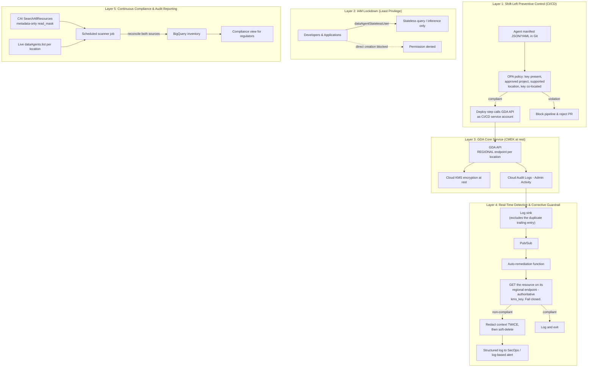

# Gemini Data Analytics (GDA) CMEK Enforcement Framework — Design & Reproduction Guide

## Metadata

* **Version:** 1.0
* **Date:** 2026-08-27
* **Author:** Google Cloud Customer Engineering & Architecture
* **Disclaimer:** **MVP reference implementation, not an officially supported
  Google product.** No SLA, support commitment or warranty. Validate it in your
  own environment before relying on it.
* **Audience:** Regulated enterprises (financial services, public sector) that
  must enforce CMEK organization-wide
* **Status:** **Validated by execution.** Every layer was built and run against
  two purpose-created GCP projects. The evidence, the platform behaviours the
  control has to work around, and the residual risk are in
  [validation-report.md](validation-report.md).
* **Product roadmap:** native CMEK organization-policy support for
  `geminidataanalytics.googleapis.com` is an open feature request with the
  product team. Ask your Google Cloud account team for current status before
  planning around the cutover in [§11](#11-deployment--cutover-runbook).

---

## 1. Executive Summary & Problem Statement

### 1.1 Context & regulatory constraint

Regulated enterprises — those subject to financial-sector technology risk
management standards or equivalent regimes — mandate that sensitive data
processed and stored in Google Cloud is protected at rest with
**Customer-Managed Encryption Keys (CMEK)** held in designated Cloud KMS
projects and regions.

Organization-wide, this is normally enforced with two constraints:

1. `constraints/gcp.restrictNonCmekServices` (deny-list) — blocks resource
   creation unless a CMEK key is supplied.
2. `constraints/gcp.restrictCmekCryptoKeyProjects` (allow-list) — restricts which
   KMS projects may hold those keys.

### 1.2 The gap: key support without org-policy enforcement

Adding `geminidataanalytics.googleapis.com` to `restrictNonCmekServices` fails:

```text
googleapi: Error 400: The policy contains invalid list value(s): [geminidataanalytics.googleapis.com].
```

* **Available today — CMEK key support at the resource level (GA).** GDA
  encrypts in-scope customer content — `DataAgent` context, instructions and
  examples — with a `kms_key` supplied **at creation time**. Verified: the key
  is honoured, and revoking it makes the content unreadable
  ([§4](#4-layer-3--cmek-encryption-at-rest)).
* **Missing — CMEK organization-policy enforcement.** The service does not
  evaluate CMEK organization policies, and its service name is not accepted in
  the constraints above. Supplying a key is therefore **optional at the API
  layer**, and no policy can make it mandatory. The product documentation states
  this plainly: *"CMEK organization policies aren't supported."*
* **Roadmap:** an open feature request with the product team; confirm current
  status with your Google Cloud account team.

Verified consequences of the gap, reproduced in a clean project:

| Attempted | API result |
| :--- | :--- |
| Create a `DataAgent` with **no `kms_key`** | **Succeeds** |
| Create a `DataAgent` with a key in an **arbitrary unapproved project** | **Succeeds** |
| Create a `DataAgent` in **`global`**, where CMEK is unavailable | **Succeeds** |

### 1.3 The solution, and its honest limits

This document specifies a five-layer **CMEK enforcement framework** that lets
regulated workloads proceed until native org-policy enforcement ships. It is
**strong but not equivalent** to native enforcement, and the difference must be
disclosed to risk and compliance functions:

> Native enforcement stops a non-compliant resource from **ever existing**. This
> framework detects one **~13–30 seconds after it exists**, scrubs its content, and
> soft-deletes it. `DeleteDataAgent` is a soft delete with a **30-day**
> tombstone and there is no purge API, so a redacted record persists for 30 days.
> During the detection window the unencrypted content is live and queryable.

The measured figures, and the precise gap against native enforcement, are in
[§8](#8-control-equivalence-matrix).

---

## 2. Validation Scope

Everything below was executed, not just designed. What that means per layer:

| Layer | Status | Evidence |
| :--- | :--- | :--- |
| 1 — CI/CD policy-as-code | **Built and tested.** A Rego v1 policy over agent manifests — Terraform has no DataAgent resource to plan against (§9) — with 30 unit tests plus a policy-gated deploy step. | `tests/run_layer1.sh` |
| 2 — IAM least privilege | **Verified behaviourally.** 45-cell persona × operation matrix run under impersonated credentials against the live API, including conversation create/list. | `tests/run_layer2.sh` |
| 3 — CMEK at rest | **Verified cryptographically**, by key revocation rather than field inspection. | `tests/run_layer3.sh` |
| 4 — Real-time remediation | **Verified**, including the negative case (a compliant agent must survive). | `tests/run_layer4.sh` |
| 5 — Continuous compliance | **Verified** against live API ground truth, including a key-revocation proof that agents hidden from the live API are caught by the CAI cross-check rather than dropped. | `tests/run_layer5.sh` |

Cutting across all five, `tests/run_unit.sh` runs **93 Python unit tests** with
no GCP project: the shared compliance verdict, the enforcer's audit-log parsing,
and every quadrant of the scanner's reconciliation matrix — including the two
“could not determine” branches a healthy live estate never reaches. It is not a
layer; it is the unit suite for the logic the layers share.

Test environment: two purpose-created projects in a Google Cloud sandbox
organization, `us-east4` plus `global` as a negative control, Google provider v7.45.0,
`google-cloud-geminidataanalytics` 0.13.1, OPA 1.19.1.

**Not covered:** multi-project / org-scoped rollout; Looker datasources; load
and cost behaviour at production scale.

---

## 3. Architecture



Two structural points worth calling out:

* **Layer 4 verifies by reading the resource, not by parsing the audit payload.**
  Because `kms_key` is immutable after creation, the server's value is
  authoritative — and this sidesteps the audit log's two incompatible entry
  shapes entirely.
* **Layers 4 and 5 share one compliance implementation**
  (`common/gda_common.py`), so the real-time and periodic controls cannot reach
  different verdicts about the same resource.

---

## 4. Layer 3 — CMEK encryption at rest

Layer 3 is documented first because Layers 1, 4 and 5 all depend on its
constraints.

### 4.1 Supported locations and endpoints — mandatory

CMEK is supported **only** in `us-east4`, `us` and `eu`. **`global` is not
supported**, so an agent there can never be CMEK-encrypted regardless of
configuration. Each location is served by its **own endpoint**:

| Location | Type | Endpoint |
| :--- | :--- | :--- |
| `global` | global | `geminidataanalytics.googleapis.com` |
| `us`, `eu` | multi-region | `geminidataanalytics.<loc>.rep.googleapis.com` |
| `us-east4` | region | `geminidataanalytics-<region>.googleapis.com` |

Calling the global endpoint with a regional resource path returns a misleading
`403 Read access to project ... was denied` — not a 404. Budget debugging time
for this; it looks like an IAM problem and is not.

Client selection matters too. The **discovery document is not publicly served**
(`403 unregistered callers` even with a valid bearer token), so
`googleapiclient.discovery.build("geminidataanalytics", ...)` is not a viable
client. Use `google-cloud-geminidataanalytics` (≥0.13.1) with an explicit
endpoint:

```python
from google.api_core.client_options import ClientOptions
from google.cloud import geminidataanalytics

def api_endpoint(location: str) -> str:
    if location == "global":
        return "geminidataanalytics.googleapis.com"
    if location in ("us", "eu"):
        return f"geminidataanalytics.{location}.rep.googleapis.com"
    return f"geminidataanalytics-{location}.googleapis.com"

client = geminidataanalytics.DataAgentServiceClient(
    client_options=ClientOptions(api_endpoint=api_endpoint("us-east4"))
)
```

Reference implementation: `common/gda_common.py`, used by every layer.

### 4.2 Creating a CMEK-protected agent

```python
agent = geminidataanalytics.DataAgent(
    display_name="Wealth Management Analytics Agent",
    data_analytics_agent=geminidataanalytics.DataAnalyticsAgent(
        published_context=published_context
    ),
)
agent.kms_key = (
    "projects/example-kms-prod/locations/us-east4"
    "/keyRings/analytics-kr/cryptoKeys/agent-key"
)
client.create_data_agent_sync(
    request=geminidataanalytics.CreateDataAgentRequest(
        parent=f"projects/{project}/locations/us-east4",
        data_agent_id="wealth-management-agent",
        data_agent=agent,
    )
)
```

**CMEK works with BigQuery datasources**, not only Looker — verified with a
BigQuery table reference. Keys can only be set **at creation**; they cannot be
added or changed later. That immutability is what makes Layer 4's
read-back verification sound.

### 4.3 Preflight — both service agents

`cloudaicompanion.googleapis.com` **must** be enabled and its service agent
granted the key role, in addition to the GDA service agent. The service agent
does not exist until the API is enabled, so this is an ordering requirement.

```bash
gcloud services enable geminidataanalytics.googleapis.com \
    cloudaicompanion.googleapis.com cloudkms.googleapis.com --project="$PROJECT_ID"

gcloud beta services identity create --service=geminidataanalytics.googleapis.com --project="$PROJECT_ID"
gcloud beta services identity create --service=cloudaicompanion.googleapis.com  --project="$PROJECT_ID"

for SA in gcp-sa-geminidataanalytics gcp-sa-cloudaicompanion; do
  gcloud kms keys add-iam-policy-binding "$KMS_KEY" \
    --keyring="$KMS_KEYRING" --location="$LOCATION" --project="$KMS_PROJECT_ID" \
    --member="serviceAccount:service-${PROJECT_NUMBER}@${SA}.iam.gserviceaccount.com" \
    --role=roles/cloudkms.cryptoKeyEncrypterDecrypter
done
```

The key and the agent must share a location.

### 4.4 Verified behaviour under key revocation

Disabling the key version produces effects that are **stronger and broader than
the documentation implies**, and both matter downstream:

| Operation | Key enabled | Key disabled |
| :--- | :--- | :--- |
| `GetDataAgent` | returns full context | **fails entirely** — `FAILED_PRECONDITION`. Metadata such as `display_name` is *not* independently readable |
| `ListDataAgents` | agent present | **agent silently omitted** — no error, just absent |
| `DeleteDataAgent` | works | works |

The second row is the dangerous one: an inventory built from `LIST` alone
**under-reports precisely when an agent's key state is suspect**. This drives two
design decisions — Layer 4 fails closed, and Layer 5 reconciles two sources.

Verification is by revocation, not by reading back the `kms_key` field, since an
echoed field proves nothing about encryption:

```
[PASS] kms_key round-trips on GET
[PASS] context readable while key ENABLED — 153 chars
[PASS] context UNREADABLE while key DISABLED — FailedPrecondition
[PASS] GET fails closed while key DISABLED
[PASS] LIST silently omits the key-disabled agent
[PASS] context readable again after key RE-ENABLED
```

Implementation: `layer3/create_agent.py`, `layer3/verify_cmek.py`.

---

## 5. Layer 1 — Shift-left policy-as-code (CI/CD)

### 5.1 Why the gate sits on manifests

The two obvious places to put a preventive control both turn out to be
unavailable for DataAgents. Both were checked, not assumed.

**Terraform.** Verified with `terraform providers schema -json` against
**google and google-beta v7.45.0**: neither `google_gemini_data_agent` nor
`google_gemini_data_analytics_data_agent` exists. The only Gemini resource
carrying a `kms_key` is `google_gemini_code_repository_index`, which belongs to
Code Assist. A `terraform plan`-based gate has nothing to inspect.

**Config Connector + OPA Gatekeeper.** The mechanism is sound and is the right
shape for this problem: Gatekeeper is a validating admission webhook, and a
`ConstraintTemplate` evaluates Rego against `input.review.object` — the JSON
payload of the incoming custom resource. Applied to a KCC CR that is genuine
*admission-time prevention*, not a CI check that anyone with API access can
bypass. It would be strictly better than the manifest gate.

**There is simply no DataAgent CRD to admit.** The
`geminidataanalytics.cnrm.cloud.google.com` group contains no
`GeminiDataAnalyticsDataAgent` — not in `apis/geminidataanalytics/v1alpha1`, nor
in `config/crds/resources`. DataAgents cannot be expressed as a KCC CR, so there
is nothing for a constraint to evaluate.

**Consequence:** until KCC adds a DataAgent CRD with a `kmsKey` field, agents are
created through the API and the shift-left gate must sit on the **agent
manifests** the deploy step feeds to that API. Keep manifests in Git; the
pipeline validates them, then a deploy step applies them.

The Rego is written so the rule bodies port to a `ConstraintTemplate` largely
unchanged if the CRD lands — the only change needed is reading each agent from
`input.review.object.spec` instead of iterating `input.agents`. Re-check CRD
availability at each Config Connector release before assuming this is still
true.


### 5.2 Policy

`layer1/policy.rego` enforces the two org-policy equivalents, three rules the
native constraints would render unnecessary, and four that reject input the
policy cannot evaluate:

| Rule | Equivalent to | Catches |
| :--- | :--- | :--- |
| Missing CMEK | `restrictNonCmekServices` | no `kms_key` |
| Unauthorized KMS project | `restrictCmekCryptoKeyProjects` | key outside the allowlist |
| Unsupported location | — | agent in `global`, where CMEK cannot apply |
| Key location mismatch | — | key and agent in different locations (API rejects at create) |
| Malformed key path | — | a bad path that would silently defeat the two rules above |
| Malformed manifest ×4 | — | missing `agents`, `agents` not an array, agent without `id`, agent without `location` |

The last group exists because of a real bypass: an agent entry with no
`location` used to pass with `allow=true`. Both location rules key off
`agent.location`, so the membership test *and* the `sprintf` that builds the
message went undefined, the rule body failed, and no denial was emitted. A
manifest whose top-level `agents` key was missing or misspelled passed for the
same reason — nothing to iterate over means nothing to deny. A gate must be able
to tell "compliant" from "I could not read this"; see
[validation-report F9](validation-report.md#f9-a-partial-read-must-never-become-a-confident-verdict).

```rego
package gda.cmek

import rego.v1

approved_kms_projects := {"example-kms-prod", "example-kms-shared"}
cmek_supported_locations := {"us-east4", "us", "eu"}

default allow := false
allow if count(deny) == 0

deny contains msg if {
	agent := input.agents[_]
	not agent.kms_key
	msg := sprintf("REJECTED [Missing CMEK]: agent '%v' must specify 'kms_key'.", [agent.id])
}

deny contains msg if {
	agent := input.agents[_]
	agent.kms_key
	kms_proj := kms_key_project(agent.kms_key)
	not approved_kms_projects[kms_proj]
	msg := sprintf("REJECTED [Unauthorized KMS Project]: agent '%v' uses KMS project '%v'.", [agent.id, kms_proj])
}

# Capture GROUP, not whole match — see §5.3.
kms_key_project(key) := proj if {
	parts := regex.find_all_string_submatch_n(`^projects/([^/]+)/`, key, 1)
	proj := parts[0][1]
}
```

Full policy including the location and malformed-path rules: `layer1/policy.rego`.
Run it in CI:

```bash
opa eval -d layer1/policy.rego -d layer1/config/approved-kms-projects.json \
  -i agents.json 'data.gda.cmek.allow' --format=raw     # -> true|false
opa eval -d layer1/policy.rego -d layer1/config/approved-kms-projects.json \
  -i agents.json 'data.gda.cmek.deny'  --format=pretty
```

The allowlist is supplied as `data`, not hardcoded, so one policy file serves
every environment. With no data supplied it falls back to a placeholder set of
non-existent projects — an environment that forgets its config fails closed
rather than silently allowing.

### 5.2a Linting: Regal, and a custom regression guard

The policy is linted with [Regal](https://openpolicyagent.org/projects/regal),
the Rego linter, wired into both `tests/run_layer1.sh` and CI. Configuration is
in `.regal/config.yaml`; every finding was fixed rather than silenced, with
three documented exceptions (each carries its reasoning inline).

More useful than the built-in rules is a **project-specific custom rule**,
`.regal/rules/custom/regal/rules/cmek/no-regex-find-n/`, which fails the build
on any use of `regex.find_n`. That is not a style preference — it is the exact
defect described in
[§5.3](#53-two-rego-hazards-this-policy-guards-against). The bug is invisible on inspection,
because the parenthesised capture group makes the call look correct, so a linter
is a far better guard than code review. The rule ships with four unit tests, and
both the test suite and CI assert that it still fires on the hazardous expression:

```rego
report contains violation if {
	some calls in ast.function_calls
	some call in calls

	call.name == "regex.find_n"

	violation := result.fail(rego.metadata.chain(), result.location(call))
}
```

### 5.3 Two Rego hazards this policy guards against

Both are traps that a CMEK policy of this shape falls into naturally, and both
are reproduced by `tests/run_layer1.sh` so the guards stay demonstrable rather
than merely asserted:

1. **A wildcard inside a negation does not compile.** `not approved_kms_projects[_] == kms_proj` yields
   `rego_unsafe_var_error: var _ is unsafe` — a wildcard inside a negation. The
   policy never loads, so *no rule runs at all*. Depending on how the pipeline
   treats a policy-load error, this either breaks every build or waves every
   build through.
2. **`regex.find_n` returns whole matches, not capture groups.** Used for key-project
   extraction it silently yields the wrong string:
   ```
   regex.find_n(`projects/([^/]+)/`, "projects/example-kms-prod/locations/...", 1)
     -> ["projects/example-kms-prod/"]
   ```
   That string can never equal an allowlist entry, so a policy built this way
   rejects **every** agent, including compliant ones — while looking correct on
   inspection. This policy uses `regex.find_all_string_submatch_n` and indexes
   the capture group.
3. **Rego v0 syntax** needs `--v0-compatible` on OPA ≥1.0. This policy is Rego v1.

Layer 1 alone is not sufficient: it governs the pipeline, and the entire premise
of Layers 2 and 4 is that out-of-band creation must also be handled.

---

## 6. Layer 2 — IAM scoping and least privilege

Restrict write access so interactive users cannot bypass the pipeline and create
unencrypted agents from the Console or CLI.

### 6.1 What the predefined roles actually grant

Verified with `gcloud iam roles describe` and re-confirmed behaviourally by
`tests/run_layer2.sh`, which impersonates one service account per persona and
attempts each operation for real.

| Role | Permissions |
| :--- | :--- |
| `dataAgentCreator` | `dataAgents.create`, `locations.chat`, `operations.get` |
| `dataAgentViewer` | `dataAgents.get`, `dataAgents.list` |
| `dataAgentUser` | `dataAgents.chat`, `.get`, `.list` |
| `dataAgentEditor` | `dataAgents.chat`, `.get`, `.list`, `.update`, `operations.get` |
| `dataAgentOwner` | `dataAgents.chat`, `.delete`, `.get`, `.list`, `.update`, `.get/setIamPolicy`, `locations.*`, `operations.*` |
| `dataAgentStatelessUser` | `locations.chat`, `locations.useDataEngineeringAgent` |

Two results here are counter-intuitive and both matter:

* **`dataAgentCreator` grants create and nothing else** — no `get`, no `list`,
  no `update`. A pipeline holding only this role can
  create an agent but **cannot read back what it created**, cannot list for
  idempotency, and cannot update. Pair it with `dataAgentViewer` (read-back) or
  `dataAgentEditor` (read-back plus update). No single predefined role covers
  create *and* read.
* **`dataAgentOwner` does not include `create`.** This is a useful property, not
  a gap: the Layer 4 enforcer needs `update` (to redact) and `delete` (to
  remediate), and is structurally unable to create the resources it polices.

Note also the two distinct chat permissions: `locations.chat` (stateless, inline
context) versus `dataAgents.chat` (against a stored agent). The stateless
runtime persona needs only the former.

### 6.2 Persona model

| Identity | Role | Verified capability | Purpose |
| :--- | :--- | :--- | :--- |
| CI/CD deployment SA | `dataAgentCreator` **+ `dataAgentViewer`** | create; read back to verify | All persistent definitions pass the Layer 1 gate first |
| Application runtime / workload identity | `dataAgentStatelessUser` | stateless `chat` only; **denied** create/get/list/update/delete | Query without the ability to create or persist |
| Analysts and business users | `dataAgentViewer` | `get` + `list`; **denied** chat and all writes | No modification of prompts or business logic |
| Individual engineers (prod) | *no GDA roles* | everything denied | Changes go through a pull request |
| Remediation function | `dataAgentOwner` | update + delete; **cannot create** | Narrowest predefined role including `dataAgents.delete` |
| Compliance scanner | `dataAgentViewer` + `roles/cloudasset.viewer` | list and read | Read-only inventory |
| **Stateful conversation runtime** | `dataAgentStatelessUser` **+ custom `gdaConversationUser`** | chat, create and read conversations; **denied** all agent CRUD, and conversation delete | Hold a conversation without any ability to change the estate |

Available roles: `admin`, `dataAgentCreator`, `dataAgentEditor`,
`dataAgentOwner`, `dataAgentStatelessUser`, `dataAgentUser`, `dataAgentViewer`,
`queryDataUser`, `viewer` — all nine confirmed present.

#### Conversations need a different service's permissions

**No `conversations.*` permission exists in Gemini Data Analytics.** Its entire
surface is 18 permissions over `dataAgents`, `locations`, `operations` and
`projects`. Conversations are gated by **`cloudaicompanion.topics.*`**, so none
of the nine predefined GDA roles can create one — including
`dataAgentStatelessUser`, whose whole purpose is chat.

Measured, one permission at a time, by reading which permission the API named:

| Operation | Requires |
| :--- | :--- |
| `create_conversation` | `cloudaicompanion.topics.create` **and** `cloudaicompanion.operations.get` |
| `get_conversation`, `list_messages` | `cloudaicompanion.topics.get` |
| `list_conversations` | *nothing — no such permission exists* |
| `delete_conversation` | `cloudaicompanion.topics.delete` |

The `operations.get` requirement is the trap: `CreateConversation` is a
long-running operation (LRO) — it returns an `Operation` you poll rather than
the finished resource — and the poll is authorized separately, so a role with
`topics.create` alone still fails — with a denial naming `operations.get`, which reads like an unrelated
problem.

No predefined role fits: `cloudaicompanion.user`/`viewer`/`editor`/
`individualUser` grant `create` only; `topicAdmin` grants `delete`/`get`/
`update` but **not** `create`; `topicReader` grants only `get`. `layer2/deploy.sh`
therefore creates a custom role, **`gdaConversationUser`**, with exactly
`topics.create`, `topics.get` and `operations.get`.

Two consequences worth stating plainly:

* **Conversation delete cannot be granted at least privilege.**
  `cloudaicompanion.topics.delete` is `NOT_SUPPORTED` in custom roles (so is
  `topics.update`). The only path is predefined
  `roles/cloudaicompanion.topicAdmin`, which also carries `topics.setIamPolicy`
  and `topics.update` — an escalation surface well beyond cleaning up your own
  conversation. This persona declines that and lets conversations expire, which
  is consistent with treating them as ephemeral.
* **Nothing can gate `ListConversations`.** There is no `topics.list`
  permission, so a principal holding no role at all can enumerate conversations.
  Do not rely on IAM alone to contain conversation metadata.
* **`cloudaicompanion` is shared infrastructure.** It is the control plane for
  the whole Gemini for Google Cloud family — Code Assist, Cloud Assist,
  Agentspace — and `topics` is a shared namespace, not a GDA-private one. Of
  2,387 predefined roles, 16 hold both prerequisites and can create a
  conversation, notably `bigquery.studioUser`, `bigquery.studioAdmin`,
  `iam.dataScientist` and the `discoveryengine.*` user roles. In a data-analytics
  estate that is most analysts, so **conversation creation cannot be contained
  by allow-grants alone** — the CMEK attestation in Layer 5 is the control that
  actually binds. See [validation-report F8](validation-report.md#f8-conversations-are-a-second-cmek-surface-governed-differently).
* **`cloudaicompanion` cannot be restricted to GDA.** It is one service for
  enablement and org-policy purposes, so `restrictServiceUsage`, API
  enable/disable and VPC-SC are all-or-nothing across Code Assist, Cloud Assist,
  Agentspace and GDA conversations. The Gemini admin settings
  (`gemini-gcp-enablement-settings` and friends) govern behaviour — web
  grounding, data sharing, mutations, release channel — not access, and cannot
  revoke a permission a role grants. The only per-principal lever is an **IAM
  deny policy** on `cloudaicompanion.googleapis.com/topics.create`, which needs
  `roles/iam.denyAdmin` at the organization or folder (**not** grantable at
  project level — though the policy itself can be *attached* to an organization,
  folder or project independently of where the admin grant sits). Verified live:
  with the policy in place a project **Owner** is denied and only the excepted
  persona gets through, because deny policies are evaluated before allow
  policies. Attachment-point trade-offs are tabulated in
  [validation-report F8](validation-report.md#f8-conversations-are-a-second-cmek-surface-governed-differently).
  Note it denies by *permission*, not by
  product, so it may also block Cloud Assist's own conversations.
  `restrictServiceUsage`, by contrast, blocks the excepted persona too — it is
  per-service, not per-principal. Both were applied to the live project and
  removed; see [validation-report F8](validation-report.md#f8-conversations-are-a-second-cmek-surface-governed-differently).
* **Do not reach for `restrictServiceUsage` as the general control.** It
  inherits down the hierarchy, so it is one org/folder policy plus a carve-out
  rather than a per-project chore — but `cloudaicompanion` is the same service
  that backs Gemini **Code Assist**, so denying it org-wide turns off code
  assistance for every developer in the organization. Reserve it for projects
  that should have no Gemini surface at all. Contain the *data* instead: host
  agents and conversations in dedicated projects, apply the deny policy there,
  and let the **CMEK attestation** be the backstop — it binds the content
  whoever created it.

Keeping this as a **separate persona** rather than widening `dataAgentStatelessUser`
is deliberate: enabling conversations reaches into another service with another
blast radius, and that should be an explicit grant to an explicit identity.

### 6.3 Verifying the boundaries yourself

```bash
bash layer2/deploy.sh      # one service account per persona
sleep 120                  # IAM propagation
bash tests/run_layer2.sh   # 45-cell persona x operation matrix
```

Standalone recipe. In a full run (§10.3) the deploy happens right after
bootstrap so the propagation overlaps with Layers 3–5 and the `sleep` is not
needed; the test also wants Layer 4 enforcing by then, so it goes last.

The probe uses **impersonation, not service-account keys**, because
`constraints/iam.disableServiceAccountKeyCreation` is enforced in most regulated
orgs — and impersonation is closer to how these identities are used in
production anyway.

It also distinguishes *denied* from *broken*. Only `PermissionDenied` counts as
DENIED; an `InvalidArgument` means the call cleared authorization and failed on
its own merits, which is reported as ALLOWED. A test that treated every
exception as a denial would report a wide-open permission as safely closed —
the exact failure mode this layer exists to rule out.

### 6.4 Supported organization policies

The Conversational Analytics API supports exactly two org-policy constraints
today. Neither is a CMEK constraint, but one is directly useful:

| Constraint | Use |
| :--- | :--- |
| `gcp.restrictServiceUsage` | Allow or deny the service in the hierarchy. An allowlist must also include underlying datasource services (BigQuery, Looker). |
| **`gcp.resourceLocations`** | **Limits where agents can be created.** Restricting to `us-east4`/`us`/`eu` closes the `global` hole *natively*, instead of relying on Layer 4 to clean up afterwards. Recommended. |

`gcp.resourceLocations` is forward-looking only — existing resources are
unaffected — so deploy it alongside, not instead of, Layers 4 and 5.

---

## 7. Layers 4 & 5 — Runtime enforcement and reporting

### 7.1 Layer 4: real-time detection and remediation

#### A. Audit log shapes — get this right or the control inverts

GDA emits **two incompatible audit shapes** for creation, both observed live:

| Method | Entries per create | `operation` field | `protoPayload.resourceName` |
| :--- | :--- | :--- | :--- |
| `CreateDataAgent` (LRO) | **2** | `first=true` / `last=true` | full agent path |
| `CreateDataAgentSync` | **1** | **absent** | **the parent only** (`projects/P/locations/L`) |

`CreateDataAgentSync` is what the Python client library actually calls. Three
failure modes follow, and a naive filter hits all three:

* A filter requiring `operation.first=true` **misses every real creation** —
  confirmed: the enforcer never fired.
* Matching both LRO entries means the trailing one, which carries no `request`,
  reads as "no `kms_key`" — so a payload-parsing enforcer **deletes a compliant
  agent**.
* For sync creates, `resourceName` is the parent, so `delete(name=resourceName)`
  targets a resource that does not exist. The agent ID is in
  `request.dataAgentId`.

#### B. Log sink filter

```text
protoPayload.serviceName="geminidataanalytics.googleapis.com"
AND protoPayload.methodName=~"CreateDataAgent"
AND NOT operation.last=true
AND NOT protoPayload.status.code>0
```

`NOT operation.last=true` keeps both shapes while dropping the LRO tail;
`NOT ...status.code>0` drops failed attempts such as `ALREADY_EXISTS`. GDA
creation is logged as **Admin Activity**, so no Data Access log configuration is
required.


#### C. Remediation logic

Full implementation: `layer4/main.py`. The four decisions that matter:

**1. Resolve the agent name from whichever shape arrived.**

```python
def resolve_agent_name(proto_payload):
    # LRO: resourceName is the agent. Sync: it is the parent, and the ID
    # lives in request.dataAgentId (with response.name as a fallback).
    ...
```

**2. Verify by reading the resource, never by trusting the payload.** `kms_key`
is immutable after creation, so the server's value is authoritative; this is
immune to payload redaction and to the duplicate LRO entry.

**3. Fail closed.** A disabled key makes `GetDataAgent` fail outright
([§4.4](#44-verified-behaviour-under-key-revocation)). An unverifiable resource
is classified `NON_COMPLIANT_UNVERIFIABLE` and remediated — "we could not check
it" is not a pass.

**4. Redact *twice*, then delete.** This is the most important correction in the
document.

`DeleteDataAgent` is a **soft delete**: the resource enters `SOFT_DELETED` with
`purgeTime = deleteTime + 30 days`, and **its content stays fully readable via
`GetDataAgent` for those 30 days**. There is no purge, force, or undelete
parameter (`?force=true`, `?purge=true`, `:purge`, `:undelete` all rejected).
Default `LIST` hides it, so a naive report shows zero violations while the
unencrypted content is still resident. **Deleting alone does not remove the
data.**

Redaction is therefore what actually removes it — and one pass is not enough,
because publishing a new context rotates the previous one into the output-only
`lastPublishedContext` field, which cannot be cleared directly:

```
initial          published='SECRET-CANARY-STRING'   last=<empty>
after redact #1  published=<empty>                  last='SECRET-CANARY-STRING'   <-- still exposed
after redact #2  published=<empty>                  last=<empty>                  <-- clean
```

```python
REDACTION_PASSES = 2

for _ in range(REDACTION_PASSES):
    client.update_data_agent_sync(request=geminidataanalytics.UpdateDataAgentRequest(
        data_agent=geminidataanalytics.DataAgent(
            name=name,
            display_name="[REDACTED BY CMEK ENFORCER]",
            data_analytics_agent=geminidataanalytics.DataAnalyticsAgent(
                published_context=geminidataanalytics.Context()),
        ),
        update_mask={"paths": ["display_name", "description", "data_analytics_agent"]},
    ))
client.delete_data_agent_sync(name=name)   # soft delete: stops use, leaves a scrubbed tombstone
```

Order is mandatory — a `SOFT_DELETED` resource can no longer be updated.

#### D. Violation classes

| Status | Trigger | Native equivalent |
| :--- | :--- | :--- |
| `COMPLIANT` | key present, approved project, supported location | — |
| `NON_COMPLIANT_MISSING_CMEK` | no `kms_key` | `restrictNonCmekServices` |
| `NON_COMPLIANT_UNAPPROVED_KEY_PROJECT` | key project not on the allowlist | `restrictCmekCryptoKeyProjects` |
| `NON_COMPLIANT_CMEK_UNSUPPORTED_LOCATION` | agent in `global` | none — new |
| `NON_COMPLIANT_UNVERIFIABLE` | `GET` failed; key state unknown | none — fail-closed |
| `NON_COMPLIANT_UNVERIFIABLE_SCAN_ERROR` | Layer 5 only: the location's `LIST` could not be read | none — fail-closed |
| `PENDING_CAI_INGESTION` | Layer 5 only: verified compliant by the live API, not yet in CAI | — |

The last two are assigned by the scanner, never by the enforcer. Keeping
`..._SCAN_ERROR` distinct from `..._UNVERIFIABLE` matters: "the API would not
list this agent" and "we could not finish asking the API" look identical in the
data but have different causes and remedies, and only the first is evidence
about the agent. Conflating them reports an outage as a customer's key problem.

#### D-bis. Fail-safe: an empty allowlist

`APPROVED_KMS_PROJECTS` is the allowlist. If it is empty, *nothing* is approved,
so `evaluate_compliance` returns `UNAPPROVED_KEY_PROJECT` for every correctly
encrypted agent and an unguarded enforcer would redact and soft-delete the whole
estate. The function therefore treats a blank allowlist as a misconfiguration:
it emits a `CRITICAL` `CMEK_ENFORCER_MISCONFIGURED` event and remediates
nothing. `layer4/deploy.sh` always sets the variable; this guards hand-edited
environment variables and partial redeploys.

#### E. Alerting

SCC custom findings require org-level activation, so the portable equivalent is
a structured log plus a log-based alert:

```json
{"security_event": "CMEK_POLICY_VIOLATION_REMEDIATED",
 "resource": "...", "caller": "...", "status": "NON_COMPLIANT_MISSING_CMEK",
 "action_taken": "CONTENT_REDACTED+RESOURCE_SOFT_DELETED",
 "residual_retention": "soft-deleted until purgeTime (~30 days); content redacted",
 "remediation_latency_seconds": 1.258}
```

#### F. Measured performance

| Case | Outcome | In-function | Wall clock |
| :--- | :--- | ---: | ---: |
| Compliant agent, approved key | **survives** | — | — |
| Missing `kms_key` | redacted + soft-deleted | 1.3–1.6 s | ~13–30 s |
| Unapproved key project | redacted + soft-deleted | 1.8–2.3 s | ~13–30 s |
| `global` location | redacted + soft-deleted | 4.8–4.9 s | ~13–30 s |

**Wall clock does not vary meaningfully by case** — it is dominated by Cloud
Logging sink → Pub/Sub delivery, which jitters by ~10 s between runs and swamps
the 3.5 s spread in function time. Do not read a per-case latency into this
table; across all measured runs every case has landed somewhere in ~13–30 s.
In-function time *does* vary by case, and `global` is consistently slowest
because the location check runs against the global endpoint.

**~3 seconds is not achievable with a log-sink architecture** — budget ~30 s. The
compliant case is the critical regression test: a filter that matches both LRO
entries deletes it.

Deploy with `DRY_RUN=true` first. A filter bug in this class of control deletes
compliant production agents.

### 7.2 Layer 5: continuous compliance reporting

#### A. Choose the CAI API deliberately — they do not behave alike

This distinction determines whether the layer works at all:

| CAI API | Returns `geminidataanalytics.../DataAgent`? |
| :--- | :--- |
| `SearchAllResources` | **Yes** — consistently, on every attempt, with a top-level `kmsKeys` field |
| `ExportAssets` → BigQuery | **Unreliably** — 1 of 7 exports returned the agents; the other 6 returned none |

Across seven exports of the same project filtered to DataAgent + CryptoKey, six
returned **0 DataAgent rows** and one returned **all 15**. The six empty runs
each polled the export operation to `done=True` before querying, so this is not
a read-before-write race.

An intermittently-populated source is more dangerous than an empty one. A query
reading from an `ExportAssets` table renders as *"fully compliant"* on a
regulator-facing dashboard most of the time, while looking like it is working —
a silent, confident false negative. Layer 5 is therefore built on
`SearchAllResources`, cross-checked against the live API.

(The asset type is also absent from the public supported-asset-types page while
working in the live API. Trust the API, not the page.)

#### B. Never export resource content

A CAI export with `contentType=RESOURCE` includes each agent's full
`publishedContext`. Landing that in BigQuery creates a **second, separately
encrypted copy of exactly the data CMEK protects** — the audit control becoming
the breach. This was directly observed: on the one export that did populate,
every DataAgent row carried its `systemInstruction` in plaintext in BigQuery.

The scanner uses a metadata-only read mask and never persists agent content:

```python
READ_MASK = "name,assetType,location,kmsKeys,createTime,updateTime,project"
```

#### C. Reconcile two sources

CAI is eventually consistent, and neither source is complete alone — a
key-disabled agent vanishes from the live `LIST` without error. The scanner
queries both and diffs them:

| Visibility | Classification |
| :--- | :--- |
| Both | evaluated normally |
| CAI only, location read successfully | `NON_COMPLIANT_UNVERIFIABLE` — a disabled key hiding it from `LIST` |
| CAI only, location `LIST` failed | `NON_COMPLIANT_UNVERIFIABLE_SCAN_ERROR` — our failure, not the agent's |
| API only, otherwise compliant | `PENDING_CAI_INGESTION` — verified by the live API, awaiting corroboration |
| API only, non-compliant | keeps its real violation status |

The last row is load-bearing: the `PENDING_CAI_INGESTION` branch is guarded on
`verdict.is_compliant`, so the label can **only** ever attach to an agent the
authoritative source has affirmatively verified. A non-compliant agent that CAI
has not ingested keeps its finding. That property is what lets the compliance
view decline to count `PENDING` as a violation without opening a hole.

The `LIST` call retries before a location is declared unreadable, and if one
still cannot be read the job writes its rows and then **exits non-zero** — an
incomplete inventory must not be reported as a clean scan. It is easy to get
this wrong in both the scanner and the harness that verifies it — swallowing the
error and continuing with a partial result; see [validation-report F9](validation-report.md#f9-a-partial-read-must-never-become-a-confident-verdict).

#### D. Compliance view

`resource.data` in the CAI export schema is a **STRING**, so the
natural-looking `JSON_VALUE(resource.data.kmsKey)` fails outright with *"Cannot access field
kmsKey on a value with type STRING"*. The correct form is
`JSON_VALUE(resource.data, '$.kmsKey')` — though the working pipeline reads
`kmsKeys` from `SearchAllResources` instead and stores it as a typed column.

```sql
CREATE OR REPLACE VIEW `${PROJECT_ID}.${BQ_DATASET}.v_agent_compliance` AS
WITH latest AS (
  SELECT MAX(scan_time) AS scan_time FROM `${PROJECT_ID}.${BQ_DATASET}.agent_inventory`
)
SELECT
  i.scan_time, i.resource_url, i.project_id, i.location, i.agent_id,
  i.configured_kms_key, i.kms_key_project, i.compliance_status, i.reason,
  i.visible_in_cai, i.visible_in_api,
  -- Three states, not two. A two-valued summary has to file "we could not
  -- check it" as either a pass or a violation, and both are wrong: the first
  -- hides exposure, the second buries real findings in noise.
  i.compliance_status = 'COMPLIANT' AS is_compliant,
  i.compliance_status IN (
    'NON_COMPLIANT_MISSING_CMEK',
    'NON_COMPLIANT_UNAPPROVED_KEY_PROJECT',
    'NON_COMPLIANT_CMEK_UNSUPPORTED_LOCATION'
  ) AS is_violation,
  CASE i.compliance_status
    WHEN 'COMPLIANT' THEN 'VERIFIED_COMPLIANT'
    WHEN 'PENDING_CAI_INGESTION' THEN 'COMPLIANT_PENDING_CORROBORATION'
    WHEN 'NON_COMPLIANT_UNVERIFIABLE' THEN 'UNVERIFIED'
    WHEN 'NON_COMPLIANT_UNVERIFIABLE_SCAN_ERROR' THEN 'UNVERIFIED'
    ELSE 'VERIFIED_VIOLATION'
  END AS verification_state
FROM `${PROJECT_ID}.${BQ_DATASET}.agent_inventory` AS i
JOIN latest USING (scan_time);
```

Which column to use:

| Column | Use it for |
| :--- | :--- |
| `is_compliant` | strict "affirmatively verified compliant". Never true for anything unverified. |
| `is_violation` | **the regulator's list.** Affirmatively non-compliant only. |
| `verification_state` | the full picture, including the unverified backlog. |

Report violations with `WHERE is_violation`, not `WHERE NOT is_compliant`. The
latter also sweeps in the unverified statuses, and filing "we could not check
this" alongside "this is unencrypted" is how a compliance report loses the
reader's trust. Not knowing remains disqualifying — `is_compliant` is false for
every unverified status and Layer 4 still fails closed — it simply is not
*reported as a breach*.

Sample output from a validation run:

| compliance_status | agents |
| :--- | ---: |
| COMPLIANT | 22 |
| NON_COMPLIANT_CMEK_UNSUPPORTED_LOCATION | 2 |
| NON_COMPLIANT_UNAPPROVED_KEY_PROJECT | 2 |
| NON_COMPLIANT_MISSING_CMEK | 1 |

Those five non-compliant agents were genuine drift, created while the Layer 4
enforcer was misconfigured and never remediated. **Layer 5 caught what Layer 4
missed** — which is the argument for running both.

#### E. Proving the two-source design

The justification for reading two sources is [F4](validation-report.md#f4-a-disabled-key-hides-an-agent-from-list-with-no-error): a
disabled key makes the live `LIST` omit an agent silently. `tests/run_layer5.sh`
demonstrates it rather than asserting it — `layer5/revocation_proof.py` disables
the key, waits for the API to start hiding agents, confirms CAI still returns
them, runs the scanner, and checks the outcome:

```
baseline: api=25 cai=27
API hid 22 agent(s) after ~50s
of those, still visible to CAI: 22
  classified NON_COMPLIANT_UNVERIFIABLE: 22
  absent from the report: 0        reported COMPLIANT: 0
```

Twenty-two agents disappeared from the live API and a `LIST`-only inventory
would have reported nothing wrong. The proof re-enables the key and rescans, so
it leaves no false "unverified" rows behind.

---

## 8. Control Equivalence Matrix

Every figure in the middle column is measured, not estimated.

| Dimension | Native CMEK org-policy enforcement | This framework (measured) |
| :--- | :--- | :--- |
| `restrictNonCmekServices` | Enforced at the API front door; resource never exists | CI/CD gate, **plus** detection + redaction + soft-delete in ~13–30 s |
| `restrictCmekCryptoKeyProjects` | Enforced at the API front door | Same as above |
| Unencryptable locations (`global`) | Not applicable | Detected and remediated; **use `gcp.resourceLocations` to prevent natively** |
| Encryption at rest | Cloud KMS via CMEK | Cloud KMS via CMEK — **identical cryptographic boundary** |
| Key revocation | Immediate lockout | Immediate lockout — verified |
| **Exposure window** | **None** | **~13–30 s live, then a redacted 30-day tombstone** |
| **Residual data** | **None** | **Soft-delete tombstone, content scrubbed by double redaction. No purge API exists.** |
| Audit trail | Cloud Audit Logs | Audit Logs + structured remediation events + BigQuery inventory |
| Coverage completeness | Total | Two reconciled sources; a key-disabled agent is flagged, not dropped |
| Lead time | Awaits product release | Deployable now |

**Disclose to risk and compliance:** the exposure window and the 30-day residual
tombstone. They are inherent to a detect-and-respond control and cannot be
engineered away with the current API surface.

---

## 9. Design decisions worth knowing

The choices below are the ones a reader is most likely to want to revisit, and
each was forced by something measured rather than chosen on style. They are
collected here so an adopter can re-evaluate them against their own environment
instead of reverse-engineering the reasoning from the code.

| Decision | Why |
| :--- | :--- |
| Layer 1 gates **agent manifests**, not `terraform plan` | google and google-beta v7.45.0 contain no `google_gemini_data_agent` resource, so a plan-based gate has nothing to inspect |
| **No admission control** (Config Connector + Gatekeeper) | Config Connector has no DataAgent CRD, so there is nothing to admit. This rules out the strongest available preventive control; the manifest gate plus a redundant in-process check is the fallback |
| Layer 4 **re-reads the resource** rather than parsing the audit payload | `kms_key` is immutable after creation, so the server's value is authoritative — and it sidesteps the two incompatible audit-entry shapes entirely (§7.1) |
| **Redact before delete, in two passes** | Delete is soft, with a 30-day tombstone that stays readable via `GET`. One pass rotates the content into the output-only `lastPublishedContext`, which cannot be cleared directly |
| Layer 5 reads **`SearchAllResources`**, not the `ExportAssets` BigQuery table | Export coverage of DataAgent is intermittent — six of seven exports returned zero rows. An intermittent source renders as "fully compliant" most of the time |
| The scanner uses a **metadata-only read mask** | A `versionedResources` read returns `publishedContext.systemInstruction` in plaintext; persisting it would turn the audit control into a second unencrypted copy of the protected data |
| **Two reconciled sources**, not one | A disabled key removes an agent from `LIST` with no error — precisely when the report most needs to be right |
| **"Could not determine" is a distinct outcome** | Layer 4 fails closed; Layer 5 classifies API-invisible rows `NON_COMPLIANT_UNVERIFIABLE`; `reconcile_check` exits INCOMPLETE rather than guessing. A partial read must never collapse into a confident verdict |
| **One shared compliance implementation** | `common/gda_common.py` is used by both the enforcer and the scanner, so the real-time and periodic controls cannot disagree about the same resource |
| **Structured logs**, not Security Command Center findings | SCC custom findings require org-level activation; a structured log plus a log-based alert is portable to any project |
| Layer 1 **rejects conversations** rather than provisioning them | The conversation CMEK key is a singleton per project + location, so there is nothing per-resource to enforce. Layer 5 attests the registered key instead |

Three things hold regardless of which of the above you revisit: the CMEK
mechanism itself is a real cryptographic boundary (§4.4), the layered
architecture is sound, and the org-policy enforcement gap that motivates all of
it is real and reproducible (§1.2).

---

## 10. Reproducing This

Everything below runs end-to-end in a throwaway project.

### 10.1 Repository layout

| Path | Purpose |
| :--- | :--- |
| `config/shared.env` | Committed defaults and placeholders |
| `config/shared.env.local` | Gitignored per-workstation values (never committed) |
| `config/_loader.py`, `scripts/prelude.sh` | Env loading with identical semantics in Python and bash |
| `common/gda_common.py` | Endpoint resolution + the single compliance verdict, shared by Layers 4 and 5 |
| `scripts/00_bootstrap.sh` | Production preflight: APIs, service agents, KMS key, build IAM |
| `scripts/01_test_fixtures.sh` | Validation-only: the unapproved key and CAI export grants |
| `layer1/policy.rego`, `policy_test.rego` | Shift-left policy and its 30 unit tests |
| `.regal/config.yaml`, `.regal/rules/` | Regal lint config and the custom `no-regex-find-n` rule |
| `layer1/apply_manifest.py` | Policy-gated deploy step (validate, then create) |
| `layer1/manifests/`, `config/`, `testdata/` | Agent manifests, the KMS allowlist, fixtures |
| `layer2/deploy.sh`, `probe.py` | Persona service accounts and the IAM behavioural probe |
| `layer3/deploy.sh` | A datasource + a CMEK-protected agent, created through the Layer 1 gate |
| `layer3/create_agent.py`, `verify_cmek.py` | CMEK fixtures and the key-revocation proof |
| `layer4/` | Remediation function, log sink, deploy script |
| `layer5/` | Compliance scanner, BigQuery DDL and view, deploy script |
| `layer5/revocation_proof.py` | Live proof that the CAI cross-check catches API-invisible agents |
| `common/gda_common.py` | Endpoint resolution and the single compliance verdict |
| `tests/run_layer{1,2,3,4,5}.sh` | Per-layer gates |
| `tests/unit/`, `tests/run_unit.sh` | Offline Python unit tests (93) — verdict, audit-log parsing, reconciliation matrix |
| `.github/workflows/cmek-policy.yml` | Reference CI pipeline: unit tests + Layer 1 policy gate |
| `scripts/99_teardown.sh` | Deletes both projects (prompts for confirmation) |

`common/gda_common.py` is deliberately the only place compliance is decided; the
deploy scripts copy it into each build context.

### 10.2 Prerequisites

* Two GCP projects — a workload project and a second holding one *unapproved*
  KMS key. The second is required: proving the `restrictCmekCryptoKeyProjects`
  equivalent needs a key outside the allowlist.
* Billing linked on both; permission to create service accounts and IAM bindings.
* Python 3.12; OPA and Regal for Layer 1; Terraform only if you want to
  re-verify the provider claim in §5.1.

Versions are pinned rather than `latest`: the policy is Rego v1 so OPA must be
≥1.0, and `.regal/` carries a custom rule written against Regal's 0.42 rule API.

```bash
pyenv virtualenv 3.12.7 gda-cmek-val && pyenv local gda-cmek-val
pip install -r layer4/requirements.txt \
            -r layer5/scanner/requirements.txt \
            -r tests/requirements-dev.txt      # pytest, for tests/run_unit.sh

mkdir -p ~/.local/bin                          # no root required
curl -sL -o ~/.local/bin/opa   https://github.com/open-policy-agent/opa/releases/download/v1.19.1/opa_linux_amd64_static
curl -sL -o ~/.local/bin/regal https://github.com/StyraInc/regal/releases/download/v0.42.0/regal_Linux_x86_64
chmod +x ~/.local/bin/opa ~/.local/bin/regal
```

Copy `config/shared.env` to `config/shared.env.local` and set `PROJECT_ID`,
`PROJECT_NUMBER`, `ROGUE_PROJECT_ID` and `APPROVED_KMS_PROJECTS`.

### 10.3 Run

```bash
# 1. Offline — no project, no credentials.
bash tests/run_unit.sh                            # 93 Python unit tests
bash tests/run_layer1.sh                          # policy: compile, lint, unit, gate

# 2. Deploy the controls, then a CMEK-protected agent on top of them.
bash scripts/00_bootstrap.sh                      # production preflight
bash layer2/deploy.sh                             # early: IAM needs ~60-120s to propagate
DRY_RUN=true bash layer4/deploy.sh                # shadow mode first
bash layer5/deploy.sh
bash layer3/deploy.sh                             # datasource + a CMEK agent via the gate

# 3. Add what the tests need, then test in dependency order.
bash scripts/01_test_fixtures.sh                  # the unapproved key (tests only)

bash tests/run_layer3.sh                          # Layer 4 must be in dry-run
( source scripts/prelude.sh                       # -> enforcing
  gcloud run services update "${FUNCTION_NAME}" --project="${PROJECT_ID}" \
    --region="${LOCATION}" --update-env-vars=DRY_RUN=false )
bash tests/run_layer4.sh
bash tests/run_layer5.sh                          # incl. the key-revocation proof
bash tests/run_layer2.sh                          # last: needs Layer 4 enforcing

bash scripts/99_teardown.sh                       # deletes both projects; prompts
```

**The sequence is dependency-ordered, not layer-numbered.** Three constraints
fix it, and none of them are cosmetic:

* **The Layer 3 test must not run while Layer 4 is enforcing.** It creates a
  *compliant* fixture and then disables its CMEK key, to prove the key is a real
  boundary. The enforcer's event for that create lands ~13–30 s later and does a
  `GET`, which fails closed while the key is disabled — so an enforcing Layer 4
  can redact and soft-delete the test's own compliant fixture mid-run. The key-disable normally propagates slower
  than the log sink delivers, so the enforcer usually wins by ~35 s, but it is a
  race either way. `tests/run_layer3.sh` refuses to start while the enforcer is
  in enforcing mode, rather than relying on this note being read.
* **The Layer 2 test goes after Layer 4 is enforcing**, so the cross-layer interaction
  is observable. Its `create` probe makes a key-less agent as the pipeline
  persona and Layer 4 remediates it, naming `layer2-cicd-deployer@...` as the
  caller — the defence-in-depth story in a single log line.
* **Layer 2's *deploy* goes early**, because IAM propagation takes ~60–120 s.
  Deploying the personas right after bootstrap lets that overlap with Layers 3–5
  instead of idling in a `sleep`.

> Note that the Layer 3 test creates only the *compliant* fixture — the hazard is the
> fail-closed race described above, not a non-compliant fixture racing the
> enforcer. See
> [validation-report F10](validation-report.md#f10-the-verification-harness-must-not-race-the-enforcer).

**Re-running against an already-provisioned estate.** Layer 4 is still in
enforcing mode from the previous run, so `tests/run_layer3.sh` will refuse to
start. Switch it to dry-run, run Layer 3, then switch it back — each half in a
subshell, because `prelude.sh` sets
`set -euo pipefail` and you do not want that in an interactive shell:

```bash
( source scripts/prelude.sh
  gcloud run services update "${FUNCTION_NAME}" --project="${PROJECT_ID}" \
    --region="${LOCATION}" --update-env-vars=DRY_RUN=true )

bash tests/run_layer3.sh

( source scripts/prelude.sh
  gcloud run services update "${FUNCTION_NAME}" --project="${PROJECT_ID}" \
    --region="${LOCATION}" --update-env-vars=DRY_RUN=false )
```

> **The bootstrap intentionally grants the encrypter/decrypter role on the
> *unapproved* key as well.** Without it, creation of the rogue-key agent fails
> with `PERMISSION_DENIED` and Layer 4's unapproved-key path is never exercised —
> the test needs creation to *succeed* so remediation is what removes it.

### 10.4 Environment obstacles

Encountered in a sandbox organization with common guardrail policies enforced;
a regulated environment will be at least as strict.

| Constraint | Symptom | Resolution |
| :--- | :--- | :--- |
| `iam.automaticIamGrantsForDefaultServiceAccounts` | Cloud Build: "missing permission on the build service account" | Grant `cloudbuild.builds.builder`, `logging.logWriter`, `artifactregistry.writer`, `storage.objectAdmin` to `<NUM>-compute@developer.gserviceaccount.com` |
| Eventarc push identity | Every push rejected: "lacks {run.routes.invoke}"; the function is never entered | Grant `roles/run.invoker` on the Cloud Run service to the function's SA. **Propagation took ~2 minutes** — do not conclude failure early |
| `iam.disableServiceAccountKeyCreation` | No SA key files possible | Use ambient ADC and attached service accounts; leave `GCP_CREDENTIALS_FILE` empty |
| `cloudfunctions.allowedIngressSettings` | — | `--ingress-settings=internal-only`; Pub/Sub push still works |

### 10.5 Gotchas that will cost you time

* **Delete is soft.** Agent IDs stay occupied until `purgeTime` (~30 days), so
  tests use run-scoped IDs. Re-running with fixed IDs fails with `AlreadyExists`.
* **Redaction needs two passes** — one leaves the content in `lastPublishedContext`.
* **Regional endpoints are mandatory**; the global endpoint returns a misleading
  `403` for regional paths.
* **`ExportAssets` returns DataAgents only intermittently** (1 of 7 exports in
  testing); `SearchAllResources` returned them every time.
* **A disabled key hides an agent from `LIST` with no error.**

---

## 11. Deployment & Cutover Runbook

### Step 1 — Preflight

`scripts/00_bootstrap.sh` performs 1–2 below against `${PROJECT_ID}`. It is
production-only: the validation fixtures live in `scripts/01_test_fixtures.sh`
and must not be run against a real project.

1. Enable `geminidataanalytics`, **`cloudaicompanion`** and `cloudkms`.
2. Create both service identities and grant each
   `roles/cloudkms.cryptoKeyEncrypterDecrypter` on every approved key
   ([§4.3](#43-preflight--both-service-agents)).
3. Confirm keys and agents share a location, and that the location is
   `us-east4`, `us` or `eu`.
4. Apply `gcp.resourceLocations` to block `global` natively.

### Step 2 — Deploy guardrails

1. Add the OPA policy to the pipeline that deploys agent manifests
   ([§5](#5-layer-1--shift-left-policy-as-code-cicd)) — **not** to a
   `terraform plan` step, which has nothing to inspect.
2. Apply the Layer 2 IAM model, removing interactive write access in
   production. Pair `dataAgentCreator` with `dataAgentViewer` for the pipeline
   identity — `dataAgentCreator` alone cannot read back what it created
   ([§6.1](#61-what-the-predefined-roles-actually-grant)). Verify with
   `bash tests/run_layer2.sh` before go-live.
3. Deploy Layer 4 with **`DRY_RUN=true`**. Confirm from the logs that compliant
   agents are classified `COMPLIANT` and only genuine violations are flagged,
   *then* arm it.
4. Deploy Layer 5 and confirm the view's agent count matches the live API.
5. Run the full negative-test matrix
   ([§7.1F](#f-measured-performance)), including the compliant-agent-survives
   case.

### Step 3 — Ongoing assurance

* Alert on `NON_COMPLIANT_UNVERIFIABLE` — it means the control could not see the
  resource, which is more serious than a known violation.
* Alert separately on `NON_COMPLIANT_UNVERIFIABLE_SCAN_ERROR` and on a non-zero
  scanner exit. Both mean the inventory is incomplete, which is an outage in the
  control rather than a finding about the estate, and they page different people.
* Alert on `CMEK_ENFORCER_MISCONFIGURED`. It means the allowlist is empty and
  remediation has disabled itself — deliberately, because the alternative is
  deleting every agent in the project.
* Alert on the Layer 4 function's error rate and on Pub/Sub subscription
  backlog; a silently broken enforcer looks identical to a clean estate.
* Reconcile the Layer 5 view against the live API on a schedule. Layer 5 found
  five agents Layer 4 missed during a single validation exercise.

### Step 4 — Cutover to native enforcement (when the product ships it)

1. Add `geminidataanalytics.googleapis.com` to
   `constraints/gcp.restrictNonCmekServices`.
2. Configure `constraints/gcp.restrictCmekCryptoKeyProjects` with the approved
   key projects.
3. Run both native enforcement and this framework in parallel for at least one
   reporting cycle and confirm they agree.
4. Decommission Layer 4. **Retain Layers 1, 2 and 5** — shift-left, least
   privilege and independent reporting remain good practice, and Layer 5 is the
   evidence that native enforcement is working.
5. Note that any tombstones created before cutover remain until their
   `purgeTime`.
